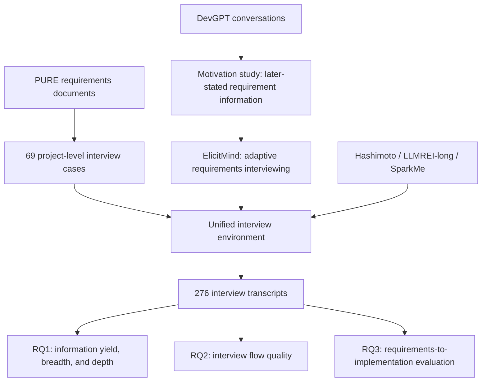

# ElicitMind Experiment Artifact

This repository contains the datasets, experimental setup, interview methods, recorded experiment data, evaluation pipelines, and analysis for **ElicitMind: Adaptive Requirements Interviewing through Evolving Requirement Understanding**.

ElicitMind maintains the current requirement understanding: elicited content, unresolved information, and supporting evidence. It uses this understanding to select interview topics and question strategies, then updates both requirement content and the interview framework from each answer.

Anonymous repositories: [experiment artifact](https://anonymous.4open.science/r/ElicitMind-Experiment) and [ElicitMind method](https://anonymous.4open.science/r/ElicitMind). The experiment code and data will be made publicly available upon acceptance.

The interview dataset contains **69 project cases**. Four methods have been run on every case, producing **276 completed interviews**. The evaluation pipelines examine the requirement information elicited, the quality of the interview flow, and the software implementations produced from the resulting requirements specifications.

## Study Workflow



The motivation study and the interview dataset use separate sources. DevGPT supplies the conversations used to investigate later-stated requirement information; PURE supplies the project descriptions used to initiate the requirements interviews.

## Repository Modules

| Module | Purpose | Guide |
| --- | --- | --- |
| `motivation/` | Analyze Later-Stated Requirement Information (LSRI) in DevGPT conversations, retaining source evidence and producing descriptive tables. | [Motivation study](motivation/README.md) |
| `dataset/` | Provide the 69 runtime cases, original PURE documents, construction provenance, screening records, and independent reviews. | [Dataset](dataset/README.md) |
| `methods/proposed_method/` | ElicitMind: project-adaptive initialization, adaptive interview planning, and answer-driven evolution of requirement understanding. | [ElicitMind method](https://anonymous.4open.science/r/ElicitMind) |
| `methods/baseline/` | Provide the Hashimoto, LLMREI-long, and SparkMe interview methods. | [Hashimoto](methods/baseline/hashimoto/README.md), [LLMREI-long](methods/baseline/llmrei-long/README.md), [SparkMe](methods/baseline/sparkme/README.md) |
| `interview/` | Run all four methods through a shared CLI with a simulated interviewee or a human respondent, and manage conversations and checkpoints. | [Interview environment](interview/README.md) |
| `results/` | Store method-by-case interview records and method-native artifacts. | [Result format](interview/README.md#results) |
| `evolution/rq1/` | Measure elicited requirement information and produce paired statistical comparisons. | [RQ1](evolution/rq1/README.md) |
| `evolution/rq2/` | Evaluate interview flow using two LLM judges and two human experts. | [RQ2](evolution/rq2/README.md) |
| `evolution/rq3/` | Generate reviewed specifications, run coding tasks, collect implementation evidence, and evaluate delivered software. | [RQ3](evolution/rq3/README.md) |
| `analysis/` | Reproduce the manuscript statistics, figures, and tables from saved experiment artifacts. | [RQ1 analysis](analysis/rq1/README.md), [RQ2 analysis](analysis/rq2/README.md), [RQ3 analysis](analysis/rq3/README.md) |

## Dataset and Interview Methods

Each case provides a project name and an initial requirements description:

```json
{
  "case_id": "PURE_001",
  "project_name": "...",
  "initial_requirements": "..."
}
```

The descriptions establish enough context to begin an interview while leaving detailed workflows, rules, exceptions, constraints, and quality requirements open to exploration. Source documents and review records are retained separately from the runtime input. See the [dataset guide](dataset/README.md) for construction criteria and provenance.

| Method ID | Method | Interview approach |
| --- | --- | --- |
| `proposed_method` | ElicitMind | Maintain current requirement understanding and use it to adapt topics, question strategies, and the interview framework. |
| `hashimoto` | Hashimoto | Fill existing slots, generate additional slots through abduction, and ask questions targeting missing information. |
| `llmrei-long` | LLMREI-long | Conduct a contextual multi-turn interview using the official long prompt and dialogue history. |
| `sparkme` | SparkMe | Coordinate an Interviewer, Agenda Manager, and Exploration Planner to track coverage and explore additional requirements. |

The method guides describe their implementations and adaptations from the source papers or upstream assets. Each method retains its own interview strategy, completion rules, and native state. `proposed_method` is the implementation identifier for ElicitMind in commands, configuration files, and saved artifacts. The shared requirements-engineering knowledge draws on Volere, IREB, and ISO/IEC/IEEE 29148; ElicitMind adapts this knowledge to each project, while the baselines retain their respective representations.

The recorded interviews use `gpt-5.4-mini-2026-03-17` for both the interviewer methods and the simulated interviewee, with a configured maximum of 100 turns per interview. All four methods have a completed record for each of the 69 cases. These settings describe the recorded experiment; model and runtime settings for new interviews are configurable.

## Quick Start

Use **Python 3.10 or newer**. Run the following commands from the repository root. The examples use PowerShell. Obtain the ElicitMind source from the [anonymous method repository](https://anonymous.4open.science/r/ElicitMind) and place its contents under `methods/proposed_method/` before installing dependencies. This directory is recorded as a Git link, so check that it contains `pyproject.toml`, `src/`, and `configs/` in a downloaded experiment artifact.

```powershell
python -m venv .venv
.\.venv\Scripts\Activate.ps1
python -m pip install -r requirements.txt
```

### Configure an interviewer and interviewee

Copy the configuration template for the method you want to run and set its model, endpoint, credentials, and runtime parameters according to its guide.

| Method | Template | Local configuration |
| --- | --- | --- |
| ElicitMind | `methods/proposed_method/configs/default.example.yaml` | `methods/proposed_method/configs/default.yaml` |
| Hashimoto | `methods/baseline/hashimoto/config/default.example.yaml` | `methods/baseline/hashimoto/config/default.yaml` |
| LLMREI-long | `methods/baseline/llmrei-long/config/default.example.yaml` | `methods/baseline/llmrei-long/config/default.yaml` |
| SparkMe | `methods/baseline/sparkme/.env.example` | `methods/baseline/sparkme/.env` |

For ElicitMind and a simulated interviewee:

```powershell
Copy-Item methods/proposed_method/configs/default.example.yaml methods/proposed_method/configs/default.yaml
Copy-Item interview/config/default.example.yaml interview/config/default.yaml
```

Configure ElicitMind's model settings in its YAML file and supply its API key through `LLM_API_KEY`. Configure the interviewee's `model.api_url`, `model.model_name`, and `model.api_key` in `interview/config/default.yaml`. Alternatively, leave the interviewee's `model.api_key` empty and use `INTERVIEWEE_API_KEY`.

```powershell
$env:LLM_API_KEY = "your-method-api-key"
$env:INTERVIEWEE_API_KEY = "your-interviewee-api-key"
```

The interviewee prompt is stored at `interview/interviewee/prompt.txt` and receives the case's project name and initial requirements. The interviewer and interviewee have separate model configurations. Local configuration files hold credentials and are excluded from version control.

### Run and inspect an interview

```powershell
python -m interview --list-cases
python -m interview --method proposed_method --case PURE_001
python -m interview --method proposed_method --case PURE_001 --inspect
```

Use `--method hashimoto`, `--method llmrei-long`, or `--method sparkme` to run a configured baseline. To answer the interview questions yourself, add `--interactive`:

```powershell
python -m interview --method proposed_method --case PURE_001 --interactive
```

Each interview writes to `results/<method_id>/<case_id>/`:

| Artifact | Contents |
| --- | --- |
| `manifest.json` | Case and method identifiers, models, completed turns, status, and completion or error messages. |
| `conversation.jsonl` | The public interviewer–interviewee dialogue. |
| `tokens.jsonl` | Interviewer-method token usage for initialization and subsequent turns. |
| `native/` | Method-owned checkpoints and logs, including `worker.log`. |

Rerunning an unfinished interview resumes saved state for ElicitMind, Hashimoto, and LLMREI-long. SparkMe sessions remain in memory and cannot resume after their worker process ends. Completed interviews are preserved when the same command is run again. The [interview guide](interview/README.md) covers explicit configuration selection, recovery, and starting a fresh run.

## Motivation Study

The motivation module investigates later-stated requirement information in real DevGPT development conversations. It identifies LSRI first expressed after the initial concrete solution, checking earlier developer messages and linked development artifacts. Earlier elicitation opportunity and subsequent solution revision connect these observations to the practical opportunity for earlier requirements elicitation.

Place the DevGPT snapshot at the location described in the [motivation guide](motivation/README.md), copy the configuration template, and configure the analysis model:

```powershell
Copy-Item motivation/config/default.example.yaml motivation/config/default.yaml
python -m motivation.cli prepare --config motivation/config/default.yaml
python -m motivation.cli analyze --config motivation/config/default.yaml
python -m motivation.cli summarize --config motivation/config/default.yaml
python -m motivation.cli inspect --config motivation/config/default.yaml
```

Prepared inputs are stored under `motivation/data/derived/`. Analysis records, summary tables, and representative-case candidates are stored under `motivation/results/`. The study retains source turns and evidence spans so individual observations can be inspected alongside aggregate counts.

## Evaluation Pipelines

All three evaluation modules read the shared interview records under `results/`. Each has its own configuration template, artifact directory, and detailed workflow. Copy the relevant `config/default.example.yaml` to `config/default.yaml` and configure the required models before running that module.

### RQ1: Requirement Information Yield, Breadth, and Depth

RQ1 extracts atomic Requirement Information Units (RIUs) from interviewee answers, removes repeated information within each transcript, and pools the unique RIUs across methods to build a shared semantic space for each Case. The paper reports information Yield, coverage Breadth, and elaboration Depth. One researcher completed a sampled quality review of 28 transcripts from seven Cases, finding no issues requiring correction or major omissions.

```powershell
Copy-Item evolution/rq1/config/default.example.yaml evolution/rq1/config/default.yaml
python -m evolution.rq1.cli all --case-id PURE_001 --config evolution/rq1/config/default.yaml
```

After inspecting a case, run the automatic processing across the dataset:

```powershell
python -m evolution.rq1.cli all --config evolution/rq1/config/default.yaml
```

Complete the exported review sheets, then summarize the review and produce reports:

```powershell
python -m evolution.rq1.cli audit-summarize --config evolution/rq1/config/default.yaml
python -m evolution.rq1.cli report --config evolution/rq1/config/default.yaml
python -m evolution.rq1.cli validate --config evolution/rq1/config/default.yaml
```

The default output root is `evolution/rq1/artifacts/`. Start reading aggregate results with `reports/transcript_metrics.csv`, `reports/method_descriptives.csv`, and `reports/pairwise_tests.csv`. See the [RQ1 guide](evolution/rq1/README.md) for stage commands, model and embedding configuration, review instructions, and checkpointed execution.

### RQ2: Interview Flow Quality

RQ2 evaluates three dimensions of observable interviewer behavior: **local coherence**, **transition quality**, and **contingent responsiveness**. Two LLM judges from different providers and two requirements-engineering experts independently evaluate complete transcripts using the same rubric. The reported judges are Claude Opus 5.5 (`claude-opus-5-5`) and GPT-6 Sol (`gpt-6-sol`), both at temperature 0. Paper statistics first average the four ratings within each Case/method/dimension, then compare methods across Cases; reports also include ordinal Krippendorff's alpha.

```powershell
Copy-Item evolution/rq2/config/default.example.yaml evolution/rq2/config/default.yaml
python -m evolution.rq2.cli prepare --config evolution/rq2/config/default.yaml
python -m evolution.rq2.cli evaluate --config evolution/rq2/config/default.yaml --judge llm_expert_1
python -m evolution.rq2.cli evaluate --config evolution/rq2/config/default.yaml --judge llm_expert_2
python -m evolution.rq2.cli export-templates --config evolution/rq2/config/default.yaml
```

The exported human templates are filled independently outside the pipeline. Generate or refresh reports from the available ratings with:

```powershell
python -m evolution.rq2.cli report --config evolution/rq2/config/default.yaml
```

The default output root is `evolution/rq2/artifacts/`. Read `reports/coverage.csv` alongside the scores and comparisons, and use `reports/report.md` as the report entry point. See the [RQ2 guide](evolution/rq2/README.md) for the rubric, expert configuration, case selection, human scoring, and rerun semantics.

### RQ3: Requirements-to-Implementation Evaluation

RQ3 measures observable functional and boundary requirement scale, cross-run judgment agreement, and complete five-run outcomes from interview-derived specifications. The selected cases are `PURE_002`, `PURE_004`, `PURE_024`, `PURE_057`, and `PURE_069`, listed in `evolution/rq3/cases.jsonl`.

The workflow converts each initial description and complete transcript into a common Software Requirements Specification (SRS) format, reviews requirement content and source support, prepares acceptance scenarios, and performs five independent implementations with the same coding configuration. The single-agent mini-swe-agent framework reduces differences from tool interfaces and agent orchestration. GPT-6 Sol evaluates recorded implementation evidence; human-reviewed judgments are the input to the paper analysis.

```powershell
Copy-Item evolution/rq3/config/default.example.yaml evolution/rq3/config/default.yaml
python -m evolution.rq3.cli prepare --config evolution/rq3/config/default.yaml --case-id PURE_002
python -m evolution.rq3.cli generate-srs --config evolution/rq3/config/default.yaml --case-id PURE_002
python -m evolution.rq3.cli export-srs-review --config evolution/rq3/config/default.yaml --case-id PURE_002
```

Complete the SRS review before finalizing it and proceeding to scenario preparation and coding. RQ3 additionally requires a working Docker environment and a dedicated coding-agent Python environment. The [RQ3 guide](evolution/rq3/README.md) describes these settings and the commands for each stage, including evidence invocations and review tables.

After processing the selected implementations and reviews, generate and verify the saved artifacts:

```powershell
python -m evolution.rq3.cli report --config evolution/rq3/config/default.yaml
python -m evolution.rq3.cli verify --config evolution/rq3/config/default.yaml
```

The default output root is `evolution/rq3/artifacts/`. Start with `reports/rq3_report.md` and consult the accompanying SRS inventory, run coverage, evidence limitations, and consistency tables.

Analyze the imported reviewed judgments and reproduce the paper's two-panel figure and four-method table:

```powershell
python analysis/rq3/analyze_rq3.py
```

The main scope is required functional requirements, business rules and constraints, and exception boundaries (FR/BR/EX). Analysis uses pooled requirement counts, conditional judgment agreement, Case-paired descriptive comparisons, and complete five-run observations. Across 100 coding runs, ElicitMind has 213 observable and 101 judgment-consistent behavioral requirements; 48 are observed in all five runs, 28 have five identical judgments, and 13 are satisfied in every run. See the [analysis definitions and outputs](analysis/rq3/README.md) and [Results text](analysis/rq3/results.md).

## Study Results

| Evaluation | Reported finding | Analysis |
| --- | --- | --- |
| Motivation | Of 553 real development conversations, 300 contain 2,400 LSRI. Of these LSRI, 640 have an earlier elicitation opportunity and correspond to a subsequent solution revision. | [Motivation study](motivation/README.md) |
| RQ1 | ElicitMind has median Yield 185 and Breadth 65, compared with the highest baseline medians of 156 and 55. Depth is reported as a distribution; Breadth comparisons retain their direction at all three clustering cutoffs. | [RQ1 results](analysis/rq1/analysis.md) |
| RQ2 | ElicitMind has mean Local Coherence 3.93, Transition Quality 3.50, and Contingent Responsiveness 3.89, each above the three baselines. | [RQ2 results](analysis/rq2/results.md) |
| RQ3 | ElicitMind has 213 observable and 101 judgment-consistent behavioral requirements, with 13 satisfied in all five implementations, each count above the three baselines. | [RQ3 results](analysis/rq3/results.md) |

The paper's RQ1/RQ2 comparisons use Case-level exact paired sign tests: one Holm family of 12 comparisons for RQ1 Yield/Breadth and one of nine comparisons for RQ2. Depth curves and RQ2 means use 10,000 Case bootstrap resamples with seed 31017. RQ3 uses descriptive statistics. Pipeline reports retain additional engineering summaries; the `analysis/` guides identify the paper's statistics and analysis scopes.

## Paper

**ElicitMind: Adaptive Requirements Interviewing through Evolving Requirement Understanding.** Publication metadata will be added after publication.
