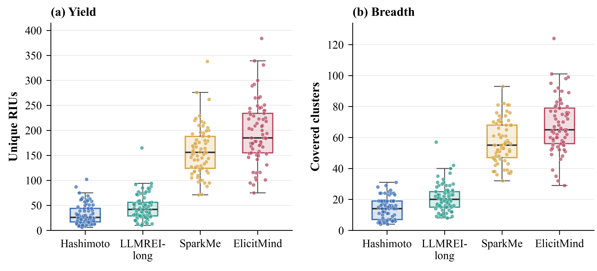
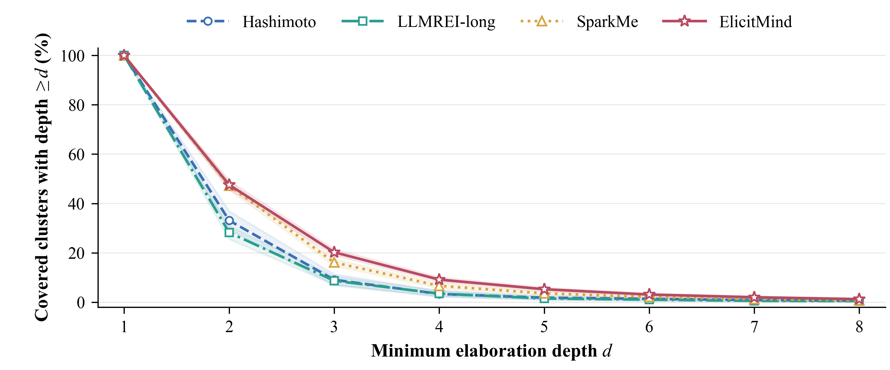
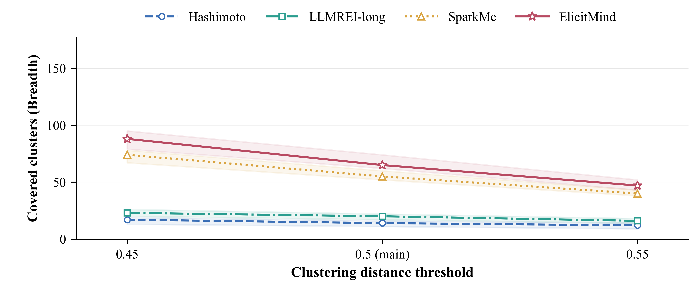

# RQ1 statistical analysis and visualization

## Dataset and outcome definitions

All 69 Cases, 276 transcripts, and 7,454 responses were included.
The four methods are matched within each Case, with one complete interview per Case/method.
The analysis unit is the Case, not an RIU, response, or DAG.
Yield is the within-transcript unique RIU count; Breadth is the covered shared-cluster count.
Breadth is also recomputed at alternative clustering cutoffs so that its sensitivity to clustering granularity can be read directly.
Input checks confirmed unique RIU counts, response counts, and agreement between cluster_depths.csv and depth_counts.
No model calls, outlier exclusions, or Case subsampling were performed.

## Table 1: raw outcomes and significance

| Method | Yield: median [Q1, Q3] | p (Holm) | Breadth: median [Q1, Q3] | p (Holm) | Responses: median [Q1, Q3] |
|:--|--:|--:|--:|--:|--:|
| Hashimoto | 26 [17, 44] | 4.07e-20 | 14 [7, 19] | 4.07e-20 | 5 [2, 6] |
| LLMREI-long | 42 [29, 56] | 4.07e-20 | 20 [15, 25] | 4.07e-20 | 15 [11, 19] |
| SparkMe | 156 [124, 188] | 0.00127 | 55 [47, 68] | 2.58e-05 | 38 [35, 43] |
| ElicitMind | 185 [155, 234] | — | 65 [56, 79] | — | 48 [42, 57] |

Quartiles use NumPy's linear interpolation convention. Both p columns report two-sided exact sign tests against ElicitMind.
The null hypothesis is equal win/loss probability among non-tied Cases. Ties are excluded from each test and explicitly counted in paired_sign_tests.csv.
Holm adjustment covers all six method pairs across two outcomes, forming one family of 12 comparisons; comparisons were not selected by significance.
These tests assess consistency of the within-Case win direction, not the magnitude of a difference between marginal medians.
Friedman omnibus results are provided separately in omnibus_tests.csv, with a distinct two-test Holm family. They do not replace pairwise comparisons.

## Figure 1: Yield and Breadth distributions

Boxes span Q1--Q3, center lines indicate medians, and whiskers reach the most extreme observations within 1.5 IQR.
Each point is an observed Case/method outcome. All observations, including points beyond the whiskers, are retained.
Horizontal jitter changes display positions only. There are no mean bars, paired-difference plots, or ratio plots.
ElicitMind has the highest median Yield and Breadth; the paired comparisons summarize the direction of the differences within Cases.

## Figure 2: Case-equal depth retention

Let N(c,m,k) count the DAGs at exact depth k for Case c and method m.
S(c,m,d) = sum(k >= d) N(c,m,k) / Breadth(c,m). Each curve is the arithmetic mean of these Case-specific fractions, with equal Case weights.
Exact DAG-depth counts remain available in source_data/depth_counts.csv; they were not reduced to MeanDepth.
Shading shows pointwise 95% percentile intervals from 10,000 Case bootstrap resamples, with seed 31017.
Every resample uses the same Case indices for the four methods. These are not simultaneous bands, and interval overlap is not a significance test.
All transcripts have positive Breadth, so no conditional fractions were missing or excluded.
Figure 2 displays depths 1--8 to avoid compressing the main pattern with a sparse tail.
The complete depth 1--18 data remain in the exported CSV files; depths above 8 still contribute to cumulative fractions at the displayed thresholds.

At depth at least 2, the Case-equal fractions are 47.55% for ElicitMind and 47.21% for SparkMe; at depth at least 3, they are 20.24% and 16.10%, respectively.
These descriptive points illustrate the distribution of elaboration depth; the complete curve shows how coverage changes across depth thresholds.

## Clustering-threshold sensitivity of Breadth

The paper reports the three thresholds in a compact table; Figure 3 is an additional visualization of the same sensitivity data.

| Distance threshold | Hashimoto | LLMREI-long | SparkMe | ElicitMind |
|:--|--:|--:|--:|--:|
| 0.45 | 17 [8, 22] | 23 [18, 31] | 74 [61, 89] | 88 [71, 103] |
| 0.5 (main) | 14 [7, 19] | 20 [15, 25] | 55 [47, 68] | 65 [56, 79] |
| 0.55 | 12 [6, 15] | 16 [12, 21] | 40 [35, 48] | 47 [41, 55] |

Breadth is recomputed by reusing the Case embeddings at the alternative cosine-distance cutoffs 0.45, 0.55 and at the primary cutoff 0.5.
The primary-cutoff values are the ones used in Table 1 and Figure 1; the alternative cutoffs only change the clustering granularity.
Changing the cutoff rescales Breadth, so the full per-cutoff table is reported instead of a single robustness scalar.
Elaboration and Depth are not recomputed at the alternative cutoffs, so this check covers Breadth only.
Lines show the median Breadth per method; shading shows pointwise 95% percentile intervals from 10,000 paired Case bootstrap resamples with seed 31017, using the same Case indices for the four methods. These intervals are not simultaneous bands.
All Case-specific values are exported in source_data/case_breadth_sensitivity.csv, and the per-cutoff tests are in tables/threshold_sign_tests.csv.

ElicitMind has the highest median Breadth at every cutoff, and every baseline comparison remains significant after Holm correction within its own cutoff. The largest adjusted p value across the 9 baseline-versus-ElicitMind tests is 6.74e-05. Changing the cutoff rescales Breadth but does not change the direction or the significance of the Breadth comparison.

## Interpretation boundaries

Median response counts are ElicitMind 48, SparkMe 38, LLMREI-long 15, and Hashimoto 5.
Table 1 measures complete-interview total outcomes, not equal-turn, equal-token, or equal-API-cost performance; it does not establish an efficiency advantage.
Curve intervals reflect empirical uncertainty in Case composition, not repeated-interview or LLM-pipeline variability within a Case.
Tests and resampling assume approximately independent Cases. Potential source-level dependencies were not audited here; conclusions are bounded to this benchmark and current run.
Crossing curves should not be described as uniform Depth superiority. No scalar Depth endpoint or per-depth significance tests were created.
The clustering-threshold check varies only the cosine-distance cutoff. The embedding model, the average-linkage rule, and the primary-threshold elaboration output were held fixed, so it does not cover embedding-model or linkage sensitivity.
One researcher completed the sampled RIU quality review of 28 transcripts from seven Cases, finding no issues requiring correction or major omissions. Completed annotations and `audit_summary.json` are retained in `evolution/rq1/artifacts/audit/`.
This plan was specified after results were visible; it is not a preregistered analysis.

## Manuscript-ready captions and statistical description

**Figure 1. Distributions of requirement-information outcomes across 69 matched Cases.**
(a) Within-transcript unique RIU counts (Yield). (b) Shared-cluster coverage counts (Breadth).
Boxes show the interquartile range, center lines indicate medians, and whiskers extend to the most extreme observations within 1.5 IQR.
Points show the 69 Case-level observations for each method.

**Figure 2. Case-equal elaboration-depth retention.**
At each integer depth d, the retained fraction is the proportion of a transcript's covered clusters with DAG depth at least d.
Lines show the mean of the Case-specific fractions, giving all 69 Cases equal weight.
Shading indicates pointwise 95% percentile confidence intervals from 10,000 paired Case bootstrap resamples (seed 31017).

**Additional figure. Sensitivity of Breadth to the clustering distance threshold.**
Each line is the median Breadth of one method across 69 matched Cases at the primary cutoff (0.5, marked on the axis) and at the alternative cutoffs 0.45, 0.55.
Shading indicates pointwise 95% percentile intervals from 10,000 paired Case bootstrap resamples (seed 31017), not simultaneous confidence bands or significance tests.
Breadth is recomputed from the frozen Case embeddings, so only the clustering granularity changes; elaboration and Depth are not recomputed.

**Statistical analysis.** Yield and Breadth were summarized using medians and first and third quartiles across 69 matched Cases.
Pairwise comparisons used two-sided exact sign tests, excluding ties, with Holm adjustment across all 12 comparisons involving four methods and two outcomes.
The tests assess the balance of within-Case wins and losses rather than the magnitude of a difference between marginal medians.
Breadth was additionally tested at each alternative clustering cutoff, with the six method pairs Holm-adjusted within each cutoff separately.
Depth was analyzed as a complete distribution using Case-equal retention curves and paired Case bootstrap intervals.
Each method was run once per Case; resampling Cases does not quantify within-Case run-to-run variability.

## Style and reproducibility

Serif typography, light axes, and compact panels follow the supplied reference's visual style.
All three figures use a coordinated blue, teal, gold, and berry palette. Figures 2 and 3 distinguish methods with circles, squares, triangles, and stars, as well as different line styles.
The reference's statistical logic, logarithmic axes, radar charts, and result wording were not copied.
Published FSE figure and table layouts informed the compact panels and booktabs table. Method colors and English labels remain consistent.
The design width is 6.6 inches; use LaTeX width=\linewidth to fit the current FSE/PACMSE single-column manuscript rather than assuming a universal double-column format.
PDFs embed TrueType fonts, SVGs retain text, and PNGs are exported at 600 dpi. Check label size after manuscript scaling.
All new scripts and outputs are under analysis/rq1. Evaluation code, original results, and reference files remain unchanged.

Style context: [FSE 2024 multi-panel distributions](https://cabird.com/pdfs/_FSE_24__Replicating_Software_Engineering_Research_with_LLMs.pdf),
[FSE 2024 Distinguished Paper table layout](https://arxiv.org/abs/2402.02063).
Layout reference: [FSE 2026 Research Papers formatting instructions](https://conf.researchr.org/track/fse-2026/fse-2026-research-papers).
Statistical references: [Benavoli et al., pairwise comparisons across datasets](https://jmlr.org/papers/volume17/benavoli16a/benavoli16a.pdf),
[Demsar, comparisons over multiple datasets](https://www.jmlr.org/papers/v7/demsar06a.html).
These references inform matched-Case comparisons; they are not evidence about the present methods' performance.

Software: Python, NumPy 1.26.4, SciPy 1.13.1, Matplotlib 3.9.4.
