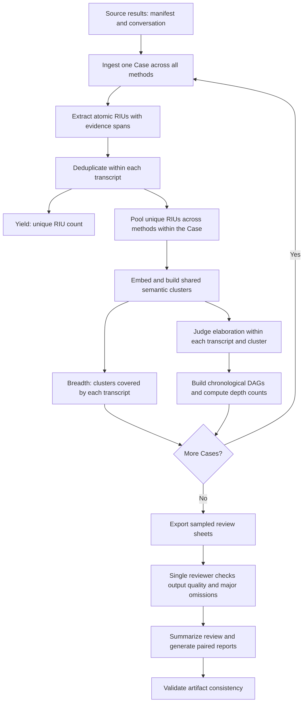

# RQ1 Evaluation Infrastructure

This package turns interview conversations into comparable requirement-information metrics. It extracts evidence-grounded Requirement Information Units (RIUs), removes repetition within each transcript, builds a shared semantic space for each Case, and measures information yield, coverage breadth, and elaboration depth. A single reviewer checks sampled pipeline outputs before cross-Case reports are generated.

Automatic processing uses the same Case artifact layout for single-Case and full runs. You can start with one Case, inspect its outputs, and then continue through the complete dataset.

The recorded experiment contains 69 Cases and 276 transcripts. One researcher completed the sampled review of 28 transcripts from seven Cases, with no issues requiring correction or major omissions. Completed annotations and the summary are under `artifacts/audit/`.

## Principles and workflow

A Case contains one transcript from each configured interview method. A transcript is one method's conversation for that Case. An RIU is an atomic piece of requirement-relevant information provided by the interviewee.



The stages implement these rules:

1. **Ingestion.** Pair each interviewer question with the following interviewee answer. Questions supply context; answers supply the information being measured.
2. **Extraction.** Split each answer into numbered evidence segments while preserving source offsets. The LLM returns atomic statements and segment ranges. Code derives `evidence_text`, `evidence_start`, and `evidence_end` directly from the original answer. The question may resolve references, but must not introduce information absent from the answer.
3. **Deduplication.** Process raw RIUs in batches within one transcript. The LLM returns confirmed duplicate matches; code constructs groups and retains unmatched items as singletons. Canonical statements come from group representatives, and every raw member retains its provenance. Added roles, conditions, constraints, boundaries, and exceptions remain separate RIUs.
4. **Shared clustering.** Pool all methods' unique RIUs for the same Case, preserving transcript membership. Embed statements in a stable order and apply average-linkage agglomerative clustering with cosine distance. Cluster IDs are local to the Case. A cluster shared by several methods supplies a common coverage category.
5. **Elaboration.** Within each transcript-cluster unit, order nodes by their earliest evidence occurrence and consider earlier-to-later pairs. The LLM returns positive elaboration relations; code derives temporal direction and reconstructs the remaining decisions as `none`. Edges form a chronological DAG. A substantive refinement adds a condition, rule, role, boundary, exception, or other operational detail.

### Metrics

| Metric | Definition |
| --- | --- |
| Yield | Number of unique RIUs after within-transcript deduplication. |
| Breadth | Number of distinct shared Case clusters covered by a transcript. |
| Cluster depth | Number of nodes in the longest elaboration path within a transcript-cluster DAG. A singleton or a DAG without edges has depth 1. |
| `depth_counts` | Number of covered transcript-cluster DAGs at each **exact** depth. For example, `{"1": 8, "2": 3}` means eight DAGs of depth 1 and three of depth 2. |
| `riu_per_response` | Yield divided by interviewee response count. |
| `riu_per_1000_tokens` | Yield per 1,000 interviewee-answer tokens. |
| `breadth_per_10_responses` | Breadth per ten interviewee responses. |

The current Depth output is an exact-depth count distribution. Reports expose scalar columns such as `depth_1_dag_count` and `depth_2_dag_count`. A transcript with zero RIUs has Yield 0, Breadth 0, and an empty `depth_counts` dictionary; its report depth-count columns are zero. For every transcript, the sum of its depth counts equals Breadth.

Clustering threshold sensitivity reuses the embeddings to recompute Breadth at the configured alternative distance thresholds. It does not recompute elaboration or Depth at those thresholds.

## Paper analysis

The paper reports Yield, Breadth, and the Case-equal Depth distribution. Its statistics and figures are reproduced with `python analysis/rq1/plot_rq1.py`; see [the analysis guide](../../analysis/rq1/README.md). Yield/Breadth use exact paired sign tests with one Holm family of 12 comparisons. Each alternative clustering cutoff has a separate six-comparison Breadth family. Depth curves use Case bootstrap intervals. The pipeline's Friedman/Wilcoxon tests, efficiency measures, and other exports remain available as additional summaries.

## Environment and configuration

Run commands from the repository root using Python 3.10 or later. Activate your existing virtual environment, for example in PowerShell:

```powershell
.\.venv\Scripts\Activate.ps1
```

The RQ1 runtime dependencies are listed in the repository's `pyproject.toml`. If they are not already installed in your environment, install the subset used by this package:

```powershell
python -m pip install "pydantic>=2.7.0" "pyyaml>=6.0.0" "httpx>=0.24.0" "numpy>=1.24.0" "scipy>=1.10.0" "scikit-learn>=1.3.0" "tiktoken>=0.7.0"
```

For a new configuration, copy `config/default.example.yaml` to `config/default.yaml` and edit the copy. Keep an existing local configuration if you already have one. The local `default.yaml` is ignored by Git.

Set these values before making model calls:

| Configuration | Purpose |
| --- | --- |
| `paths.results_root` | Directory containing method/Case source conversations. |
| `paths.artifacts_root` | Root for Case artifacts, review sheets, and reports. |
| `methods` | Method directory names included in the comparison. |
| `llm.api_url`, `llm.model_name` | Full chat-completions endpoint URL and model name for extraction, deduplication, and elaboration. |
| `embedding.api_url`, `embedding.model_name` | Full embeddings endpoint URL and model name. |
| `embedding.dimensions` | Requested embedding dimension; must match the endpoint's returned vectors. |

Both clients use OpenAI-compatible HTTP request/response structures. Endpoint URLs are used as configured, including the endpoint path.

For each client, a nonempty `api_key` takes precedence over `api_key_env`. You may enter the key directly in the local YAML:

```yaml
llm:
  api_key: "YOUR_CHAT_API_KEY"
embedding:
  api_key: "YOUR_EMBEDDING_API_KEY"
```

These are excerpts to edit inside the complete configuration. Alternatively, leave `api_key` empty, set `api_key_env` to an environment-variable name, and define the variables in the current PowerShell session:

```powershell
$env:RQ1_LLM_API_KEY = "YOUR_CHAT_API_KEY"
$env:RQ1_EMBEDDING_API_KEY = "YOUR_EMBEDDING_API_KEY"
```

The resolver also accepts a literal key beginning with `sk-` in `api_key_env`. If the named variable supplies no key, chat resolution checks `OPENAI_API_KEY`, then `LLM_API_KEY`; embedding resolution checks `OPENAI_API_KEY`, `EMBEDDING_API_KEY`, then `LLM_API_KEY`. This package does not automatically load a `.env` file.

Relative input and artifact paths are resolved against the repository root. Use an explicit `--config` in commands to keep the configuration consistent across stages.

Useful controls in the example configuration are:

| Setting | Default | Effect |
| --- | --- | --- |
| `llm.concurrency` | 4 | Concurrent extraction, transcript deduplication, or elaboration-unit tasks. |
| `llm.timeout_seconds` | 120 | Chat request timeout. |
| `llm.max_retries` | 3 | Additional attempts for chat transport failures, HTTP 429, and server errors. |
| `llm.deduplication_batch_size` | 50 | Number of new raw RIUs considered per deduplication batch. |
| `embedding.batch_size` | 64 | Texts per embedding request. |
| `clustering.distance_threshold` | 0.5 | Main cosine-distance clustering cutoff. |
| `clustering.sensitivity_thresholds` | `[0.45, 0.55]` | Alternative cutoffs for Breadth sensitivity. |
| `elaboration.pair_batch_size` | 100 | Candidate pairs per elaboration request. |
| `audit.case_count`, `audit.random_seed` | 7, 31017 | Number of sampled Cases and reproducible sampling seed. |
| `statistics.bootstrap_repeats` | 10000 | Bootstrap repetitions for descriptive mean confidence intervals. |
| `statistics.tokenizer_encoding` | `cl100k_base` | Encoding used to count interviewee-answer tokens. |

## Source results and ingestion

Prepare inputs in this layout:

```text
results/
  hashimoto/<case_id>/manifest.json
  hashimoto/<case_id>/conversation.jsonl
  llmrei-long/<case_id>/manifest.json
  llmrei-long/<case_id>/conversation.jsonl
  sparkme/<case_id>/manifest.json
  sparkme/<case_id>/conversation.jsonl
  proposed_method/<case_id>/manifest.json
  proposed_method/<case_id>/conversation.jsonl
```

Use the manifests and conversations produced by the interview runner. The manifest supplies Case/method metadata and `completed_turns`; conversation records contain `turn_index`, `role`, and `content`, with roles `interviewer` and `interviewee`. The full manifest schema is defined by `ManifestRecord` in `models.py`.

Without `--case-id`, all configured method directories must contain the same nonempty set of Case directories. With `--case-id`, that Case must exist under every configured method. Ingestion rejects empty turns, answers without questions, consecutive questions, trailing unanswered questions, metadata mismatches, and response counts inconsistent with `completed_turns`. The source results are read only.

`ingest` performs the results extraction needed by subsequent stages: it writes normalized `transcripts.jsonl` and `responses.jsonl`. No manual conversion or use of method-native summaries is needed.

## Start with one Case

Run the automatic chain for one Case:

```powershell
python -m evolution.rq1.cli all --case-id PURE_001 --config evolution/rq1/config/default.yaml
```

This processes every configured method for `PURE_001`, writes Case artifacts, and validates the automatic outputs. It does not require human review or create aggregate statistical reports.

To inspect each stage separately, execute the following in order:

```powershell
python -m evolution.rq1.cli ingest --case-id PURE_001 --config evolution/rq1/config/default.yaml
python -m evolution.rq1.cli riu --case-id PURE_001 --config evolution/rq1/config/default.yaml
python -m evolution.rq1.cli clustering --case-id PURE_001 --config evolution/rq1/config/default.yaml
python -m evolution.rq1.cli elaboration --case-id PURE_001 --config evolution/rq1/config/default.yaml
python -m evolution.rq1.cli validate --case-id PURE_001 --config evolution/rq1/config/default.yaml
```

`breadth` is an alias for `clustering`; `depth` is an alias for `elaboration`. Individual stage commands require their upstream artifacts. `validate --case-id` requires the completed automatic chain.

Inspect evidence and grouping in `riu/`, shared assignments in `clustering/`, and DAGs plus metrics in `elaboration/`. To process another Case, repeat the command with another Case ID. There is no Case-count limit flag; selecting individual IDs controls the initial scale.

## Continue to the complete dataset

Omit `--case-id` to process all discovered Cases:

```powershell
python -m evolution.rq1.cli all --config evolution/rq1/config/default.yaml
```

`all` completes ingestion, RIU processing, clustering, and elaboration for one Case before moving to the next. It skips stages whose required final files already exist, so prior single-Case work is reused. After automatic processing, it exports the sampled review sheets and returns with instructions for human review if annotation is incomplete. This intentional pause returns exit code 0; it does not mean final reporting is complete.

An individual stage command without `--case-id` runs that stage across all Cases. It does not use `all`'s final-file skip rule: RIU and elaboration stages restore their checkpoints, while clustering makes embedding requests again.

### Progress, interruptions, and reruns

The console prints Case/stage starts, restored checkpoint counts, extraction completion counts, deduplication batch progress, embedding batch completion, elaboration-unit progress, and network retries. Completion logs are emitted after work finishes; they are not a continuous heartbeat during an outstanding request. A large elaboration unit may need several pair batches before its unit-completion message appears.

| Stage | Persisted progress |
| --- | --- |
| Extraction | Each completed response in `riu/extraction_units.jsonl`. |
| Deduplication | Batch state in `riu/deduplication_batches.jsonl` and completed transcripts in `riu/deduplication_units.jsonl`. Batch state is cleared after successful completion. |
| Clustering | No embedding-batch resume checkpoint. An unfinished stage re-embeds the Case when rerun. |
| Elaboration | Completed transcript-cluster decisions in `elaboration/decision_units.jsonl`. Pair batches within an unfinished unit are rerun. |

On a task failure, pending tasks are cancelled; already running requests may take time to finish. Errors are recorded in the affected RIU or elaboration stage's `errors.jsonl`. Successful completion clears that stage's error file. Checkpoints are revalidated against current inputs on restoration.

After a transient failure or interruption, rerun the same command **without `--force`** to retain progress. `all` stops on an automatic-stage failure and does not continue to subsequent Cases.

Use `--force` when intentionally rebuilding outputs:

```powershell
python -m evolution.rq1.cli all --case-id PURE_001 --force --config evolution/rq1/config/default.yaml
```

For a single stage, `--force` removes that selected stage's output directory before rerunning it. For `all --case-id`, it rebuilds every automatic stage of that Case. Full `all --force` rebuilds all Cases and clears/re-exports the aggregate audit sheets, requiring fresh annotation.

Changes to source data, prompts, models, or processing parameters do not automatically invalidate existing final files. Rebuild affected stages and their downstream stages explicitly. For a uniform pipeline rule change, rerun the complete dataset and review the new outputs. After a Case rebuild, refresh affected aggregate review and report outputs; a single-Case command does not update them.

## Single-reviewer quality check

The default sample contains seven Cases and all four methods for each selected Case. `audit-export`, `audit-summarize`, and `report` operate on the complete Case set and reject `--case-id`.

The reviewer checks pipeline output quality using three CSV files under `<artifacts_root>/audit/`:

| File | Required annotation | Review question |
| --- | --- | --- |
| `extraction_review.csv` | `evidence_faithful` | Does the interviewee evidence span support the RIU statement? |
| `extraction_review.csv` | `requirement_relevant` | Does the RIU contain requirement-relevant information? |
| `extraction_review.csv` | `segmentation_adequate` | Is the unit's granularity reasonable, without merging independent information or meaningless over-splitting? |
| `deduplication_review.csv` | `deduplication_correct` | Are merged members semantic duplicates, with no loss of added conditions, roles, or boundaries? |
| `transcript_review.csv` | `has_major_omissions` | Does a quick reading of the sampled transcript reveal obvious substantial omissions? |

Enter `1` for yes and `0` for no; `true/false` and `yes/no` are also accepted. Fill every applicable annotation and use `review_note` to describe problems. For the first four quality questions, `1` indicates acceptable output; for `has_major_omissions`, `1` indicates a problem.

Extraction sheets retain full questions and answers, including placeholder rows for zero-RIU responses. Leave the three RIU-quality annotations blank on those placeholder rows and include their answers in transcript-level omission screening. Deduplication sheets contain only groups with multiple members. If none exist, the sheet has only its header and the summary reports zero reviewed groups with correctness `null`.

Read each sampled transcript using the questions/answers in the extraction sheet or the source conversation. This review does not require recreating a complete RIU gold set, assigning new gold groups, or a second reviewer. The summaries measure the proportion of accepted RIU/group annotations and transcripts with major omissions. There is no automatic quality acceptance cutoff.

Edit the original CSVs or save copies named `extraction_review_completed.csv`, `deduplication_review_completed.csv`, and `transcript_review_completed.csv`. A corresponding `*_completed.csv` takes precedence when present. Preserve identifiers, source columns, and CSV encoding; edit annotation/note fields.

A direct `audit-export` rewrites the base templates. Do not rerun it during annotation. Non-forced `all` preserves existing complete or partially filled sheets when all three files exist; if any is missing, it exports the three templates again. Keep review files from an earlier run separately when intentionally regenerating them.

If quality problems require changing the pipeline, update the relevant prompt or rule uniformly, rerun the full processing chain, and review its new outputs before using the resulting metrics.

## Summarize, report, and validate

After review, run:

```powershell
python -m evolution.rq1.cli audit-summarize --config evolution/rq1/config/default.yaml
python -m evolution.rq1.cli report --config evolution/rq1/config/default.yaml
python -m evolution.rq1.cli validate --config evolution/rq1/config/default.yaml
```

Alternatively, rerun non-forced `all`; it skips completed automatic stages, preserves completed review sheets, and continues through these commands. Blank or invalid required annotations fail summary generation.

`report` requires all discovered Cases' upstream artifacts, threshold-sensitivity outputs, and the audit summary. It counts answer tokens with the configured encoding, generates method-level descriptive statistics with bootstrap 95% confidence intervals for means, and compares methods using Case-aligned Friedman and paired Wilcoxon tests. Pairwise p-values receive Holm correction within each metric. In `pairwise_tests.csv`, median differences and rank-biserial effects use the direction `method_a - method_b`. Read the reported sample size alongside each result.

Final `validate` checks coverage and provenance across stages, evidence slices, deduplication membership, cluster assignments, Breadth, DAG chronology, recomputed depths/counts, and report consistency. It also recomputes the audit summary from the selected review CSVs and compares both JSON copies. Deterministic validation establishes structural and arithmetic consistency; the reviewer supplies the semantic quality assessment.

## Artifact layout and result files

With the example `artifacts_root`, outputs are organized as follows:

```text
evolution/rq1/artifacts/
  cases/<case_id>/
    ingestion/
      transcripts.jsonl
      responses.jsonl
      summary.json
    riu/
      extraction_units.jsonl
      raw_rius.jsonl
      deduplication_batches.jsonl
      deduplication_units.jsonl
      deduplication_groups.jsonl
      unique_rius.jsonl
      errors.jsonl
      summary.json
    clustering/
      embedding_index.jsonl
      embeddings.npy
      cluster_assignments.jsonl
      transcript_cluster_coverage.jsonl
      breadth_metrics.jsonl
      threshold_sensitivity.csv
      summary.json
    elaboration/
      decision_units.jsonl
      dags.jsonl
      cluster_depths.csv
      transcript_metrics.jsonl
      errors.jsonl
      summary.json
  audit/
    extraction_review.csv
    deduplication_review.csv
    transcript_review.csv
    audit_summary.json
  reports/
    ...
```

The optional completed review CSVs are stored beside their base templates. Cross-Case commands read `cases/<case_id>/` directly; older top-level `ingestion/`, `riu/`, `clustering/`, or `elaboration/` directories are not consumed or migrated.

The ten aggregate report files are:

| File | Use |
| --- | --- |
| `transcript_metrics.csv` | One row per Case/method: Yield, Breadth, depth counts, response/token counts, and efficiency metrics. |
| `paired_metrics.csv` | One row per Case, with method-specific columns for Yield, Breadth, and exact-depth DAG counts. |
| `method_descriptives.csv` | Method/metric summaries and bootstrap mean confidence intervals. |
| `omnibus_tests.csv` | Friedman statistics, p-values, and sample sizes. |
| `pairwise_tests.csv` | Paired Wilcoxon results, differences, effect sizes, and Holm-adjusted p-values. |
| `depth_distribution.csv` | Total DAG count at each exact depth by method. These are counts, not normalized proportions. |
| `efficiency_metrics.csv` | Response/token counts and normalized Yield/Breadth measures. |
| `threshold_sensitivity.csv` | Case/method Breadth under alternative clustering cutoffs. |
| `audit_summary.json` | Copy of the single-reviewer quality summary. |
| `summary.json` | Report dimensions, evaluated metrics, and test counts. |

Start result analysis with `transcript_metrics.csv`, `method_descriptives.csv`, and `pairwise_tests.csv`; use Case artifacts to inspect the evidence behind individual measurements. CLI options are also available through `python -m evolution.rq1.cli --help` and each subcommand's `--help`.
