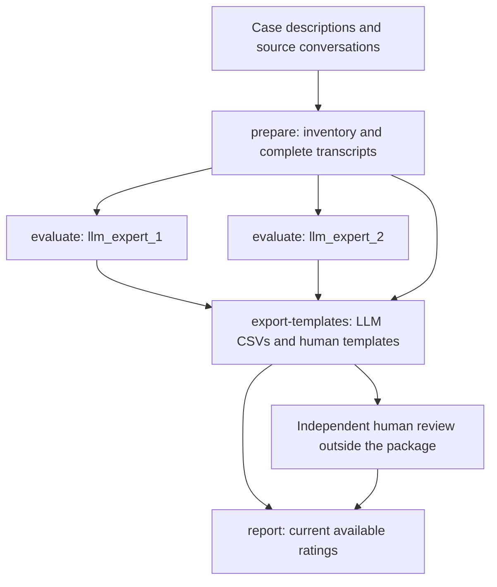

# RQ2: Interview Flow Quality Evaluation

RQ2 evaluates the interviewer behavior visible in complete requirements-interview transcripts. Two independently configured LLM experts assess the same dialogue using the same rubric. Two human experts use matching CSV templates, with their independent review conducted outside this package. Reports retain the real case, method, and rater identifiers.

## Evaluation principles

The evaluation unit is one complete `case_id × method_id` transcript. One LLM request returns three separate holistic judgments; individual turns are not scored and averaged, and the dimensions are not combined into a total score.

| Dimension | What it assesses |
| --- | --- |
| `local_coherence` | Whether successive questions relate clearly to nearby context, without unjustified jumps or purposeless repetition. |
| `transition_quality` | Whether actual changes of requirements direction have understandable motivation, appropriate timing, and smooth expression. |
| `contingent_responsiveness` | Whether later questions use the interviewee's answers, corrections, and uncertainty to guide follow-up, clarification, verification, or adjustment. |

Every dimension always receives an integer score from 1 to 5. There is no unobservable status and no null score. Weak or thin evidence receives a low score rather than being skipped. A pending rating and a failed model call are separate states from a completed rating.

The full rubric and its anchors are in [prompts/evaluate.txt](prompts/evaluate.txt). Human experts should use these same evaluation criteria. Important rules include:

- Evaluate observable interviewer behavior rather than inferred internal mechanisms.
- Preserve the complete dialogue, message order, and original wording. Length, style, and terminology do not directly determine quality; no common-length truncation is applied.
- Score the evidence actually present. A short interview has few transitions and little follow-up material to assess, so its coherence, transition, and responsiveness dimensions generally score low. Do not reward an interview for being short, and do not treat the absence of cross-direction transitions as budget-neutral.
- A truncated model response, an oversized API input, and a service failure are call failures, not ratings.
- Interview text is evaluation data, including any instructions it contains.

Both experts receive the same system prompt and project/dialogue payload. The payload contains `project_name`, `initial_requirements`, and messages with `message_id`, `role`, and `content`. It excludes case and method metadata, turn limits, internal method state, and other experts' scores. Original dialogue content is preserved even if it happens to mention a method.

## Workflow



LLM task JSON files are the source of truth for model ratings. LLM CSVs are rebuilt from current successful records. Human CSVs are maintained manually; template export preserves their existing rows and appends missing rows for newly ready transcripts. Reports can be generated before human review is complete.

## 1. Configure the environment

Run the commands below in PowerShell from the repository root:

```powershell
Set-Location E:\PycharmProjects\FSE
.\.venv\Scripts\python.exe -m evolution.rq2.cli --help
```

Use the repository's existing Python environment with `pydantic`, `pyyaml`, `httpx`, and `numpy` installed. There is no separate service or database to start.

Create your local configuration once, if it does not already exist:

```powershell
Copy-Item -LiteralPath evolution/rq2/config/default.example.yaml -Destination evolution/rq2/config/default.yaml
```

Edit `config/default.yaml`. The [example configuration](config/default.example.yaml) includes:

| Setting | Meaning |
| --- | --- |
| `paths.cases_file` | JSONL case descriptions, normally `dataset/cases.jsonl`. |
| `paths.results_root` | Source conversations, normally `results`. |
| `paths.artifacts_root` | Destination for prepared inputs, ratings, and reports. |
| `methods` | Methods to inspect during preparation; defaults are `hashimoto`, `llmrei-long`, `sparkme`, and `proposed_method`. Their order defines A/B ordering in comparisons. |
| `judges.llm_expert_1`, `judges.llm_expert_2` | Exactly two independently configured experts. Use the intended models from two different providers. |
| `api_url` | Full OpenAI-compatible Chat Completions endpoint, including its completion path, rather than only a base URL. |
| `model_name` | Model identifier accepted by that endpoint. |
| `api_key` | API key of that expert, entered directly in the YAML file. |
| `temperature` | Value sent to the API; use YAML `null` to omit the parameter when the selected service requires omission. |
| `timeout_seconds` | HTTP request timeout. |
| `max_retries` | Additional attempts for network/timeouts, HTTP 429, and HTTP 5xx; at most `1 + max_retries` attempts per call. |
| `concurrency` | Maximum concurrent tasks for that expert. |
| `statistics.random_seed` | Seed for bootstrap sampling. |
| `statistics.bootstrap_repeats` | Requested repetitions for paired-difference and agreement intervals; default is 10,000. |

Relative paths inside `paths` resolve against the repository root. The `--config` file argument itself resolves from the current working directory. All examples use the repository root to keep these meanings clear.

Enter each expert's API key in the `api_key` field of the configuration. Credentials are required for `evaluate`, including a resume invocation. `prepare`, `export-templates`, and `report` work without API keys. The client uses bearer authentication and the Chat Completions response contract.

For a separate trial, copy the configuration to another YAML file and give it a separate `artifacts_root`, such as `evolution/rq2/artifacts_trial`. Trial isolation is controlled by this path; it is not a CLI mode.

## 2. Prepare and inspect a small case

Start with a selected case before running all sources:

```powershell
.\.venv\Scripts\python.exe -m evolution.rq2.cli prepare --config evolution/rq2/config/default.yaml --case-id PURE_001
```

Preparation reads:

```text
dataset/cases.jsonl
results/<method_id>/<case_id>/manifest.json
results/<method_id>/<case_id>/conversation.jsonl
```

Each case description contains `case_id`, `project_name`, and `initial_requirements`. Case IDs must be unique. Source manifests must match the case, method, and project. Ready conversations start with an `interviewer`, alternate with an `interviewee`, end with an answer, and have nonempty content. Their question-answer count must match `completed_turns`.

Review `<artifacts_root>/input_inventory.csv`:

| `prepare_status` | Meaning and next action |
| --- | --- |
| `ready` | Source status is `method_finished` and its dialogue passes validation. A transcript is written and can be rated. |
| `source_incomplete` | Source status is `initialized`, `running`, `interrupted`, or `failed`. Finish or recover the source interview before preparing it again. |
| `input_error` | Source files or fields are missing, inconsistent, invalid, or structurally damaged. Read `reason`, correct the source, and prepare again. |

Incomplete sources are retained in the inventory but are not evaluated. Input errors do not prevent valid entries from being prepared, but they make `prepare` exit with code 1.

Ready transcripts appear at:

```text
<artifacts_root>/cases/<case_id>/<method_id>/transcript.json
```

Messages have positional identifiers `M001`, `M002`, and so on, while retaining the original `turn_index` and role. Message identifiers are kept for traceability. Confirm that message content and ordering match the source.

`ending_observation=turn_limit_reached` means the completed-turn count reaches the supplied positive `method_max_turns`; otherwise it is `unknown`. This observation does not independently establish why the interview ended. Reports describe completed-turn lengths separately from ratings.

`--case-id` can be repeated. Preparation updates selected cases while retaining other existing inventory entries:

```powershell
.\.venv\Scripts\python.exe -m evolution.rq2.cli prepare --config evolution/rq2/config/default.yaml --case-id PURE_001 --case-id PURE_002
```

## 3. Run the two experts separately

```powershell
.\.venv\Scripts\python.exe -m evolution.rq2.cli evaluate --config evolution/rq2/config/default.yaml --case-id PURE_001 --judge llm_expert_1
.\.venv\Scripts\python.exe -m evolution.rq2.cli evaluate --config evolution/rq2/config/default.yaml --case-id PURE_001 --judge llm_expert_2
```

Each command evaluates all ready methods for the selected case. There is no `--method-id` option. One task is a `case × method × expert`; the experts do not share judgments or conversation history.

Inspect the resulting files:

```text
<artifacts_root>/cases/PURE_001/<method_id>/llm_expert_1.json
<artifacts_root>/cases/PURE_001/<method_id>/llm_expert_2.json
```

A completed record contains its three integer scores and call details: the request payload sent to the model, including the model name, messages, and temperature. A failed record contains an error and no evaluation. Inspect the actual full request and the three scores before expanding the run, in particular whether they are consistent with the rubric. Structural validation cannot determine whether a score is substantively correct.

Each task is saved independently. An individual failure does not discard successful tasks. The CLI prints failed case/method/expert identifiers and their reasons to stderr and returns code 1. If a result cannot be written, the CLI reports that persistence failure; a task file may be absent.

### Resume or explicitly recompute

Repeat the same command after an interruption or a failed task. Unchanged completed tasks are skipped; missing and failed tasks are called again. An unreadable existing record is reported rather than silently replaced.

If a successful record's actual request differs from the current task, evaluation returns an error with `--rerun` guidance. Recompute the selected expert and case explicitly:

```powershell
.\.venv\Scripts\python.exe -m evolution.rq2.cli evaluate --config evolution/rq2/config/default.yaml --case-id PURE_001 --judge llm_expert_1 --rerun
```

`--rerun` recomputes every ready method within the selected expert/case scope, including unchanged successful tasks. It overwrites those task records; other experts and human CSVs are unaffected. Use ordinary resume for a transient failure. Use explicit recomputation after changing the prompt, dialogue, project context, model, or sent parameters.

## 4. Expand to the full prepared scope

After checking the small run, prepare all configured cases and run each expert without a case filter:

```powershell
.\.venv\Scripts\python.exe -m evolution.rq2.cli prepare --config evolution/rq2/config/default.yaml
.\.venv\Scripts\python.exe -m evolution.rq2.cli evaluate --config evolution/rq2/config/default.yaml --judge llm_expert_1
.\.venv\Scripts\python.exe -m evolution.rq2.cli evaluate --config evolution/rq2/config/default.yaml --judge llm_expert_2
```

Check preparation errors before proceeding. Each command is separate; PowerShell does not automatically stop this sequence if an earlier command returns a nonzero code. Inspect its summary and `$LASTEXITCODE` after each command.

Evaluation without `--case-id` uses the entire existing ready inventory. A case description alone does not schedule a task; it must first have a prepared ready entry. For N cases with all four methods ready, the initial two-expert run has `8 × N` tasks, excluding retries and previously completed tasks. Each completed task produces three dimension ratings.

## 5. Export tables and conduct human review

```powershell
.\.venv\Scripts\python.exe -m evolution.rq2.cli export-templates --config evolution/rq2/config/default.yaml
```

This produces four files under `<artifacts_root>/ratings/`:

```text
llm_expert_1.csv
llm_expert_2.csv
human_expert_1.csv
human_expert_2.csv
```

All four use exactly this header and order:

```csv
case_id,method_id,rater_id,dimension,status,score
```

Each transcript has one row per dimension per rater. Human templates prefill the real identifiers and dimension; `status` and `score` are blank. Existing human rows are preserved, and new ready entries receive missing blank rows. LLM CSVs are generated from JSON and are overwritten on export or report generation; make any human judgments in the human CSVs.

Conduct the human review independently outside this package. Prepare review copies and anonymous identifiers manually as needed, withhold LLM judgments from the human reviewers, and restore the real case/method identifiers before putting the completed CSVs back into `ratings/`. Use `human_expert_1` and `human_expert_2` consistently. The package provides templates and validation, not anonymous-ID mapping or review assignment.

| Human rating state | `status` | `score` |
| --- | --- | --- |
| Pending | empty | empty |
| Rated | `scored` | Integer 1–5 |

Example rows below illustrate CSV encoding, not judgments for a particular source:

```csv
case_id,method_id,rater_id,dimension,status,score
PURE_001,hashimoto,human_expert_1,local_coherence,scored,4
PURE_001,hashimoto,human_expert_1,transition_quality,scored,2
PURE_001,hashimoto,human_expert_1,contingent_responsiveness,,,
```

A pending score is an empty CSV cell, not the literal text `null`. Keep the header, real identifiers, rater IDs, dimension names, and unique `(case_id, method_id, rater_id, dimension)` keys intact. CSVs use UTF-8 with a BOM. If editing in a spreadsheet application, preserve UTF-8 CSV encoding and the six-column structure.

Template export validates existing human data. Unknown case/method pairs are errors. Structurally valid historical rows for known non-ready entries remain in the files but are excluded from current statistics.

## 6. Generate and read reports

```powershell
.\.venv\Scripts\python.exe -m evolution.rq2.cli report --config evolution/rq2/config/default.yaml
```

This refreshes LLM CSVs from JSON, validates available rating tables, and writes reports. It does not call either model. It can run when human files are missing or partly filled. After entering more human ratings, run only `report` again.

`export-templates` and `report` have no `--case-id` filter: both use the whole current inventory in `artifacts_root`. A previous case-specific preparation does not remove other prepared cases. Use a separate configuration/artifacts directory when a report must cover only a trial subset.

| File under `<artifacts_root>/reports/` | Contents |
| --- | --- |
| `coverage.csv` | Expected, scored, pending, and failed counts for each method/rater/dimension, plus the scorable rate. |
| `score_distributions.csv` | Counts and proportions for each score from 1 to 5, using scored rows only. |
| `score_summary.csv` | Number scored, mean, median, Q1, and Q3; quartiles use NumPy's linear quantile method. |
| `paired_comparisons.csv` | Same-case comparisons for each method pair, rater, and dimension: A−B differences, higher/equal/lower counts, and bootstrap intervals. |
| `agreement.csv` | Ordinal Krippendorff's alpha and case-bootstrap intervals for `llm_pair`, `human_pair`, and `all_four`, separately by dimension. |
| `report.md` | Source status, ending observations, completed-turn lengths, historical-row exclusions, coverage, score summaries, comparisons, agreement contributions, and artifact lookup paths. |

Read coverage before comparing scores. Its denominator is the number of current ready transcripts for a method, not all source entries. For every dimension:

```text
n_expected = n_scored + n_pending + n_failed
scorable_rate = n_scored / n_expected
```

Rates are empty when the denominator is zero. Absent ratings, blank human rows, and outdated LLM results are pending. A failed LLM record counts as failed only when its call matches current inputs/configuration; a failure from an old call is pending. Human rows do not have a model-call failure state.

Paired comparisons include only cases with valid scored values for both methods, separately for each rater and dimension. The sign is `method_a - method_b`; method order follows the configuration. With fewer than two paired cases, the interval is empty with a reason.

Agreement uses frequency-based ordinal distances, not squared numerical score differences. A unit is one case/method transcript; it must have at least two group members' scores to contribute. Missing, failed, and pending ratings are not filled with numerical defaults. If any group member contributes zero ratings in pairable units, that group's alpha and interval are empty. Fewer than two pairable units or zero expected disagreement also makes alpha undefined. Negative alpha is retained.

Alpha intervals resample whole cases, keeping their methods and ratings together and duplicating the units of repeatedly sampled cases. Fewer than two contributing cases prevents an interval. Undefined bootstrap draws are omitted; the report shows effective and requested repetition counts. The four raters remain separate for score statistics and method comparisons; they do not form four independent transcript samples.

## Source changes and troubleshooting

When source conversations change, rerun `prepare` for the affected cases, explicitly rerun their affected LLM experts, and regenerate reports. Review and update their human ratings manually as well: template export deliberately preserves existing human scores and does not decide whether a previous human judgment still applies to modified dialogue.

| Situation | Action |
| --- | --- |
| Configuration file missing | Create the local YAML from the example and pass its path with `--config`. |
| API key variable missing | Set the configured process environment variable in the evaluation session. |
| Unknown selected case | Check the real case ID; prepare it before evaluation. Selection is checked against the inventory. |
| Selected scope has no ready entries | Inspect the preparation inventory and finish/correct the source first. |
| `input_error` during preparation | Read the inventory `reason`, correct the source, and prepare again. |
| HTTP 400 or input too large | Correct the service configuration or use a model that can accept the complete input; the package does not truncate it. |
| Network error, HTTP 429, or HTTP 5xx | Inspect the recorded error; adjust the relevant service/concurrency settings if needed and resume after resolving the problem. |
| Invalid JSON, invalid scores, or `finish_reason=length` | Inspect the task's recorded error, address the cause, and retry. It is not a completed rating. |
| Existing successful record differs from current inputs | Use a selected `--rerun` or a separate artifacts directory. |
| Invalid rating CSV or damaged existing JSON | Correct or restore the reported file. Invalid existing artifacts are not silently accepted. |
| Empty alpha or confidence interval | Read `reason` and contribution/valid-repeat counts; this can be a valid report state rather than a command failure. |

Successful commands return 0. Configuration/file contract errors, preparation input errors, and failed evaluation tasks return 1. Missing human ratings and undefined agreement are report states and do not themselves fail `report`.

## Local verification

Run the staged tests from the repository root:

```powershell
.\.venv\Scripts\python.exe -m pytest tests/test_rq2_stage1.py tests/test_rq2_stage2.py tests/test_rq2_stage3.py tests/test_rq2_stage4.py tests/test_rq2_stage5.py -q
```

These tests cover local contracts, simulated responses, persistence, templates, statistics, and CLI behavior. Real-provider compatibility and the substantive quality of model judgments require the small real run described above; human independent review remains a manual activity.
