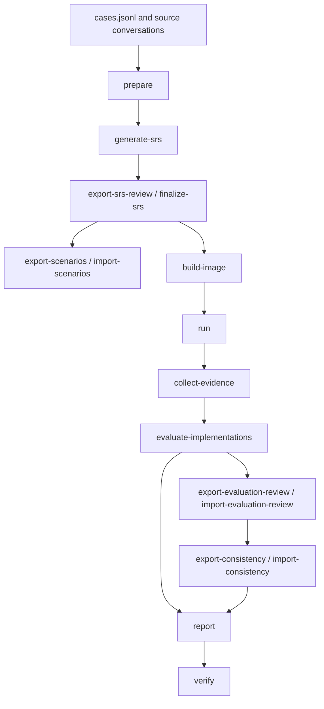

# RQ3: Downstream Implementation Evaluation

RQ3 examines the observable scale of functional and boundary requirements obtained from interviews and the agreement of their judgments across repeated implementations. Each method's initial description and complete transcript are converted to the same SRS format, reviewed, and used for five independent implementations under a common coding configuration. Five Cases and four methods give 100 coding runs.

The coding agent is mini-swe-agent 2.4.6 with `openai/gpt-5.4-mini-2026-03-17`, at most 200 steps and 3,600 seconds per run, and no container network. Its simple single-agent workflow helps reduce differences from tool interfaces and agent orchestration. Recorded implementation evidence is judged by `gpt-6-sol`; human-reviewed requirement judgments are the input to the paper analysis.

The main scope combines functional requirements (FR), business rules and constraints (BR), and exception boundaries (EX). Observable and judgment-consistent requirement counts describe the downstream validation scope; five-run satisfaction counts describe requirements fulfilled in every independent implementation. The [paper analysis guide](../../analysis/rq3/README.md) defines these measures. Four-direction consistency views are retained as auxiliary qualitative evidence.

Every stage has a separate command. Structured products are JSON/JSONL, human-edited tables are UTF-8 CSV, and reading views are Markdown. Commands exchange structured objects and run the requested stage.

## Workflow



## Commands

Invoke every command as `python -m evolution.rq3.cli <command> --config <path>`.

| Command | Module | Purpose |
| --- | --- | --- |
| `prepare` | `ingest` | Read input state and write standardized transcripts. |
| `generate-srs` | `srs` | Generate a draft SRS from one prepared transcript. |
| `export-srs-review` | `review` | Export the item review table of a draft. |
| `finalize-srs` | `review` | Apply the filled item review and write the reviewed SRS. |
| `export-scenarios` | `review` | Export the observation scenario table of a reviewed SRS. |
| `import-scenarios` | `review` | Read and record the filled scenario table. |
| `build-image` | `container` | Build the container image that the configuration names. |
| `run` | `coding` | Execute explicitly selected coding tasks. |
| `collect-evidence` | `evidence` | Collect build/run and scenario evidence for selected runs. |
| `evaluate-implementations` | `evaluate` | Judge requirements from the recorded evidence. |
| `export-evaluation-review` | `review` | Export the requirement judgment review table. |
| `import-evaluation-review` | `review` | Read and record the filled judgment review table. |
| `export-consistency` | `evaluate` | Export the four-direction conclusion table. |
| `import-consistency` | `evaluate` | Read and check the filled four-direction table. |
| `report` | `report` | Build the coverage, evidence and comparison views from saved artifacts. |
| `verify` | `report` | Check stored artifacts for missing files, invalid references and pending records. |

`--case-id` and `--method-id` restrict a command to selected Cases and methods, and each can be
repeated. `run` and `collect-evidence` also accept `--run-index`, repeated as needed. Any command
with a run range requires either an explicit `--case-id` together with `--run-index`, or `--all`;
`--all` is the only way to select a whole batch. Unknown identifiers and out-of-range indices are
errors, and no command falls back to another task.

## Configure the environment

Run the commands in PowerShell from the repository root:

```powershell
.\.venv\Scripts\python.exe -m evolution.rq3.cli --help
```

Use the repository Python environment with `pydantic`, `pyyaml` and `httpx` installed. Coding
tasks additionally use the dedicated agent environment at `evolution/rq3/.venv-agent`.

Build the updated container image before collecting evidence. It includes the delivered Python
dependency set, including Flask 3.0.3 and pytest 8.3.2, so the current requirements can be installed
with `coding.network: none`. A missing requirements file or another invalid delivered build command
remains a recorded build failure; the collector does not replace that command.

Create your local configuration once:

```powershell
Copy-Item -LiteralPath evolution/rq3/config/default.example.yaml -Destination evolution/rq3/config/default.yaml
```

| Setting | Meaning |
| --- | --- |
| `paths.cases_file` | JSONL Case descriptions, normally `evolution/rq3/cases.jsonl`. |
| `paths.results_root` | Source conversations, normally `results`. |
| `paths.artifacts_root` | Destination for prepared inputs, SRS, runs, evidence, evaluations and reports. |
| `methods` | Method identifiers to inspect. Their order fixes table and report order. |
| `artifact_processor` | Model that generates the draft SRS. |
| `coding` | Coding model, agent interpreter, image, per-SRS run count, budgets and container settings. |
| `implementation_evaluator` | Model that judges requirements from recorded evidence. |

The `artifact_processor` and `implementation_evaluator` sections each carry `api_url`,
`model_name`, `api_key` and `timeout_seconds`. The URL is a full OpenAI-compatible Chat
Completions endpoint including its completion path, and `timeout_seconds` bounds one HTTP request.

The `coding` section configures the agent's model client rather than a plain HTTP client, so it
carries `api_url`, `model_name` and `api_key` but no `timeout_seconds`. Its `api_url` is the
OpenAI-compatible API base of the coding model, such as `https://api.example.com/v1`; litellm
appends `/chat/completions`. Do not include `/chat/completions` in `coding.api_url`, because
the SDK would append it again. Use `openai/<provider-model-id>` for `coding.model_name`.
The runner passes the URL and key to the worker as `OPENAI_BASE_URL` and `OPENAI_API_KEY`.
Run specifications and trajectories omit API URL fields. Their output paths are relative to
the run directory; result paths are relative to `paths.artifacts_root`. Logs and trajectory
error details remove the configured API URL and key and strip host directory prefixes.
`coding.command_timeout_seconds` bounds one command inside the container and is not an HTTP
timeout. Relative paths resolve against the repository root; the `--config` argument itself
resolves from the current working directory.

Each of the three sections takes its key in the `api_key` field of the YAML file. Keys are read
from the configuration at call time and never written to a product file. Keep the local
configuration out of version control, because it holds a credential.

`coding.agent_python` selects the interpreter of the agent environment. `coding.image` and
`coding.network` are shared by coding and evidence containers, so `build-image` and
`collect-evidence` need only those two settings and do not require a coding model or its key.
`coding.network` applies to both container stages and defaults to `none`.

Each command loads only the configuration it uses:

| Commands | Required configuration |
| --- | --- |
| `prepare`, `export-srs-review`, `finalize-srs`, `export-scenarios`, `import-scenarios`, `report`, `verify` | `paths`, `methods` |
| `generate-srs` | `paths`, `methods`, `artifact_processor` |
| `build-image`, `collect-evidence` | `paths`, `methods`, `coding` container settings |
| `run` | `paths`, `methods`, `coding` |
| `evaluate-implementations` | `paths`, `methods`, `implementation_evaluator` |

## Artifact layout

```text
<artifacts_root>/
  input_inventory.csv
  cases/<case_id>/<method_id>/
    transcript.json
    srs/
      generation_record.json
      draft_srs.json
      srs_review.csv
      reviewed_srs.json
      reviewed_srs.md
      scenarios.csv
    runs/run_NN/
      task.md
      result.json
      process.log
      trajectory.json
      workspace/
      evidence/
        evidence.json
        verification.json
    superseded/run_NN/attempt_NN/
    evaluations/
      evaluations.json
      judgment_review.csv
      consistency.csv
      reviewed_judgments.json
  reports/
    input_coverage.csv
    srs_inventory.csv
    run_coverage.csv
    method_case_consistency.csv
    evidence_limitations.csv
    environment.json
    rq3_report.md
```

Derived artifacts under `srs/` are removed when a new draft is generated, so a regenerated SRS
never reuses an earlier review. Evidence records use identifiers of the form
`EV-{run:02d}-{scenario_id}-{seq:02d}` and refer to captured files by relative path. An earlier
run directory that was started from a different reviewed SRS is moved to
`superseded/run_NN/attempt_NN/` and keeps its deliverables, while the current run starts from an
empty directory.

## 1. Prepare inputs

```powershell
.\.venv\Scripts\python.exe -m evolution.rq3.cli prepare --config evolution/rq3/config/default.yaml --case-id PURE_002
```

Preparation reads `paths.cases_file` and, for each Case and method, the source conversation under
`paths.results_root`. It writes one `transcript.json` per Case/method and records the outcome of
each attempt in `input_inventory.csv` as one of:

| `prepare_status` | Meaning |
| --- | --- |
| `ready` | Source and dialogue pass validation; the transcript can be used downstream. |
| `source_incomplete` | The source interview has not finished. Finish or recover it, then prepare again. |
| `input_error` | Files or fields are missing, inconsistent or damaged. Read `reason` and correct the source. |

Input errors do not prevent valid entries from being prepared, but they make `prepare` return 1.
The coverage report of a later `report` adds `not_prepared` for a Case/method that has no inventory
row at all. Selecting a subset of methods updates those rows only and keeps the recorded state of
the entries outside the selection.

## 2. Generate and review the SRS

```powershell
.\.venv\Scripts\python.exe -m evolution.rq3.cli generate-srs --config evolution/rq3/config/default.yaml --case-id PURE_002
.\.venv\Scripts\python.exe -m evolution.rq3.cli export-srs-review --config evolution/rq3/config/default.yaml --case-id PURE_002
```

`generate-srs` calls `artifact_processor` once per prepared transcript and writes
`generation_record.json` plus `draft_srs.json`. A draft that already succeeded is skipped; pass
`--force` to regenerate it, which also discards the reviewed SRS derived from the previous draft.

`export-srs-review` writes `srs_review.csv`. Fill `decision` on each row with `accept`, `revise`,
`delete` or `regenerate_document`; a `revise` decision also uses `revised_type`,
`revised_statement`, `revised_status` and `revised_evidence_json`. Keep the identifiers, the
statement and the evidence summary unchanged.

```powershell
.\.venv\Scripts\python.exe -m evolution.rq3.cli finalize-srs --config evolution/rq3/config/default.yaml --case-id PURE_002
```

`finalize-srs` applies the filled table and writes `reviewed_srs.json` and `reviewed_srs.md`.
Rows without a decision leave the document incomplete; the command reports them and returns 1.

## 3. Record observation scenarios

```powershell
.\.venv\Scripts\python.exe -m evolution.rq3.cli export-scenarios --config evolution/rq3/config/default.yaml --case-id PURE_002
.\.venv\Scripts\python.exe -m evolution.rq3.cli import-scenarios --config evolution/rq3/config/default.yaml --case-id PURE_002
```

`export-scenarios` writes one row per reviewed requirement of `scenarios.csv`. For each row set
`evaluation_scope`, `is_core`, `scenario_id`, `setup`, `action` and `expected_observation`.
`evaluation_scope` is `required`, `context_only` or `unresolved`; only `required` requirements are
evaluated later. The table stays a template until `action` and `expected_observation` are filled;
`report` still describes it and names the fields that are empty in the `pending_scenario_fields`
column of `srs_inventory.csv`. `import-scenarios` requires both fields and validates the filled
table before recording it in place.

## 4. Build the image and run coding tasks

```powershell
.\.venv\Scripts\python.exe -m evolution.rq3.cli build-image --config evolution/rq3/config/default.yaml
.\.venv\Scripts\python.exe -m evolution.rq3.cli run --config evolution/rq3/config/default.yaml --case-id PURE_002 --run-index 1
```

`build-image` builds `coding.image` from `evolution/rq3/container/Dockerfile`. `run` executes the
selected coding tasks: one task per reviewed SRS and run index, each in a fresh container that
mounts only that task's `workspace/`. A successful task records `result.json`, `process.log` and
`trajectory.json`, and the delivered source tree stays in `workspace/`.

A run is created only for a reviewed SRS. A finished `result.json` is reused only while the run
recorded the same `task.md`, so a task whose reviewed SRS changed is executed again with the new
input. Retry an interrupted or failed run by repeating the command with the same selection; a task
that already delivered a workspace from the same input is reported as an infrastructure failure
instead of being restarted over its own output.

## 5. Collect evidence

```powershell
.\.venv\Scripts\python.exe -m evolution.rq3.cli collect-evidence --config evolution/rq3/config/default.yaml --case-id PURE_002 --run-index 1 --invocations invocations.json
```

Evidence collection starts a container from `coding.image`, replays the delivered build and run
entries, and executes every selected scenario. It writes `evidence/evidence.json` and
`evidence/verification.json`. `verification.json` records `collected`, `entry_missing` (the task
delivered no `delivery.json`) or `infrastructure_failed`; a run that was not collected makes the
command return 1.

For HTTP deliveries, the run observation starts the declared command, waits two seconds and records
a response from the declared `local_url` before stopping the service. Any HTTP response establishes
that the service is listening; it does not establish that the requested feature works. A process
that exits before observation or a connection failure is recorded as an unsuccessful startup.
CLI and file deliveries continue to use command exit status. `collected` means the observations
were recorded, not that the build, startup or requirements all succeeded.

`--invocations` names a JSON array of invocation descriptions. Every selected scenario needs one
entry, identified by `case_id`, `method_id`, `run_index` and `scenario_id`:

```json
[
  {
    "case_id": "PURE_002",
    "method_id": "hashimoto",
    "run_index": 1,
    "scenario_id": "SC-01",
    "interface_type": "cli",
    "timeout_seconds": 60,
    "cli": {"command": "python3 app.py sample.txt", "stdin": ""}
  }
]
```

`interface_type` selects exactly one payload: `cli` (`command`, `stdin`), `http` (`start_command`,
`url`, `method`, `request_body`, `headers`, `wait_seconds`, `setup`, `actions`), `ui` (`target` as `browser` or `desktop`, `url`,
`start_command`, `wait_seconds`, `steps`, `screenshot_name`) or `file` (`command`, `output_files`,
`inspect_pdf`). `working_directory` is relative to `/workspace`; use an empty string for the workspace root.

HTTP `setup` requests establish the scenario's preconditions before the target request. Optional
`actions` requests run afterward to exercise additional actions or inspect resulting state. Each
request specifies `url`, `method`, `request_body`, `headers` and optional `capture`. A capture such
as `{"customer_id": "id"}` extracts the response JSON field `id`; subsequent URLs and request
bodies refer to it as `${customer_id}`. Dotted paths select nested JSON fields and numeric path
components select list elements. All requests share one service process and cookie session.
Captured values preserve their JSON types when a request body uses a complete placeholder value:
`"customer_id": "${customer_id}"` sends a number if the creation response returned a numeric ID.
URL and header placeholders use the text form of the value. Form bodies must use
`Content-Type: application/x-www-form-urlencoded`.
Each response is saved separately, with its setup/action role and redirect exchanges. A failed
setup stops the workflow and records that the target was not executed; the captured setup
responses remain HTTP observations for evaluation. An error response to the target action remains
observed behavior. Compound service commands execute in a shell. For browser UI invocations,
`start_command` starts the local web service before Chromium opens `url`.

When no replay of the required action is defined, use `interface_type: "unavailable"` and
`unavailable: {"reason": "Describe the missing setup, action or observation"}`. This records an
`observation_limit` without substituting an unrelated endpoint. Requirements with only these
records receive `not_observable` without a model call. It does not assert that the software failed.

File invocations with `inspect_pdf: true` record each output page's text, dimensions and rotation
alongside file size and page count. Use identifiable source pages to observe ordering and content;
blank pages alone do not establish these properties. Browser screenshots remain available for
human visual review; the current text-only evaluator does not inspect screenshot pixels.

## 6. Evaluate implementations

```powershell
.\.venv\Scripts\python.exe -m evolution.rq3.cli evaluate-implementations --config evolution/rq3/config/default.yaml --case-id PURE_002
```

This judges each required requirement of each discovered run from the recorded evidence only, and
writes `evaluations/evaluations.json`. A judgment is `observed_satisfied`, `observed_partial`,
`observed_unsatisfied`, `not_observable` or `coding_failure`, and cites the evidence identifiers it
rests on. A requirement whose scenarios recorded no observation, and a run without a successful
coding result, keep a program-produced judgment instead of a model call. Failed judgments are
printed and make the command return 1.

The evaluator uses the SRS requirement as its criterion. Only scenario identifiers and recorded
evidence are sent with the requirement; setup, action and `expected_observation` remain collection
guides and are excluded from the judgment input.
For a conditional requirement, the evidence must establish the relevant preconditions and connect
the result to the condition under test. A request stopped by login, a missing customer or an empty
cart does not establish shipping-address validation. Such evidence cannot support either
satisfaction or failure of that target rule. However, when normal recorded operations lose the
session or corrupt the cart, the resulting order-placement failure is observed software behavior.
It does not establish failure of pricing, rounding, payment or shipping features that were never
reached. Missing customer-profile details and missing shipping-address fields are different test
conditions; rejection of one cannot establish enforcement of the other.
That failure can refute the ability to place orders, but cannot refute a prerequisite restriction on
orders that were never placed. An order placed while a required prerequisite is demonstrably false
does violate that restriction. Comparative security requirements need an observed baseline and
restriction, or a stated permission policy; a successful staff action alone does not show inadequate
restrictions. Do not invent mandatory owner approval or additional confirmation.
Use the delivered interface's demonstrated actor protocol; a role-based API does not require an
invented browser session, and its accepting a role does not prove secure access control. Assess
each explicit clause and condition branch: partial coverage requires positive evidence for at least
one complete obligation or branch, with another required part untested or violated. Successful setup
or one known prerequisite is not a satisfied part. An order placed with available stock but unknown
cart confirmation does not establish either prerequisite restriction; a fully confirmed and available
cart reaching checkout covers the allowed branch only. A total without a fractional-cent calculation
does not establish rounding. Recorded checkout totals do not require an unstated pre-submission UI.
Generic state dumps cannot establish that a feature is absent. Use a matched successful
control to distinguish a business-rule rejection from an unrelated refusal, and use independent
records when one test may consume or change another test's preconditions. Recollect affected
evidence after changing invocations, then rerun evaluation. Changes only to the evaluation prompt
or its input construction require reevaluation using existing evidence, without recollection;
earlier judgments retain the earlier rubric.

A rule-specific block can enforce a restriction before the final workflow action: rejecting a
purchase quantity explicitly because it exceeds recorded stock exercises the stock restriction at
cart entry, even without a subsequent checkout. Other unrelated preparation failures do not.

A capability with a boundary includes both allowed-context ability and forbidden-context
restriction: refusal before shipping refutes cancellation ability, even when cancellation after
shipping is also refused. Cart addition alone partly covers maintenance; a later change to existing
contents establishes ongoing maintenance. Payment-method selection alone partly covers payment
support; an order labelled `paid` does not establish processing without a payment action and result.
Role-dependent actions need the stated actor role. For ownership rules, identified own-record access
covers the allowed branch, while complete anonymous access returning private customer content
violates the restriction. A target customer ID alone is not an acting identity. Abridged request
context cannot establish anonymous access, and a generic service acknowledgement is not private data.
A complete successful public request can establish capability availability without an account;
public browsing and initial setup do not acquire unstated login requirements. This does not prove
secure role or ownership restrictions. An abridged request with unknown authentication context
does not establish public availability.
For role-dependent operations, testing only one of the enumerated eligible roles leaves the other
untested. A generic setup acknowledgement does not establish that requested settings were applied
or a configured feature became available; require returned settings, a readback, or recorded use.
An unspecified requirement to restrict processed-order changes is not an unconditional ban;
an authorized owner's successful change alone does not prove restrictions absent. Address-format
validation does not imply geocoding or city-country verification unless stated. A plausibly
formatted address being accepted alone does not establish validation.
For international-address acceptance with an explicit format-flexibility clause, one accepted
foreign address is partial coverage; materially different accepted formats can establish flexibility.
Changing IDs, endpoints or field names adds no format coverage. An acceptance-only requirement can
be met by one international example; acceptance does not establish invalid-format detection.
The evaluator receives a literal evidence-ID catalog and generates references and scoped reasons
before choosing a status. Active account status alone does not establish immediate usable access;
a payment label does not establish processing. Configured options do not establish address
eligibility, and setup validation alone does not establish a go-live restriction. The recorded
fixtures cover these distinctions and include positive controls for the actual capabilities.

```powershell
.\.venv\Scripts\python.exe -m evolution.rq3.cli export-evaluation-review --config evolution/rq3/config/default.yaml --case-id PURE_002
.\.venv\Scripts\python.exe -m evolution.rq3.cli import-evaluation-review --config evolution/rq3/config/default.yaml --case-id PURE_002
```

Fill `decision` in `evaluations/judgment_review.csv` with `accept` or `revise`; a row without a
decision is still pending and the import skips it. The columns `status`, `evidence_ids`, `rationale`
and `limitation` hold the candidate that `export-evaluation-review` wrote, so leave them unchanged.
`accept` confirms that candidate as exported, and `revise` replaces it with `revised_status`,
`revised_evidence_ids`, `revised_rationale` and `revised_limitation`. A blank
`revised_limitation` clears the candidate's limitation for a revised judgment. A status of `observed_satisfied`,
`observed_partial` or `observed_unsatisfied` must cite at least one evidence ID, and every cited ID
must belong to the same Case, method, run and requirement scenario; `import-evaluation-review`
rejects a row that cites an unknown or unrelated identifier. Re-running `evaluate-implementations`
writes new candidates and clears `evaluations/reviewed_judgments.json`, so a table that was exported
before that run no longer describes the current candidates: export it again and fill the decisions
in the new table. An import of the outdated table is rejected, and `verify` reports
`stale_judgment_review`.

## 7. Auxiliary four-direction conclusions

```powershell
.\.venv\Scripts\python.exe -m evolution.rq3.cli export-consistency --config evolution/rq3/config/default.yaml --case-id PURE_002
.\.venv\Scripts\python.exe -m evolution.rq3.cli import-consistency --config evolution/rq3/config/default.yaml --case-id PURE_002
```

`export-consistency` writes one row per method and dimension: `build_run`, `core_requirement`,
`boundary_constraint` and `observable_behavior`. Set `consistency_status` to `consistent_positive`,
`consistent_negative`, `mixed`, `evidence_limited` or `not_applicable`, and cite the runs and
evidence that support it. An empty `consistency_status` stays pending and is never read as a
negative conclusion. `import-consistency` checks the filled table against the cross-run matrix and
rejects evidence from another Case, method or unreferenced run.

In consistency views, `✓` marks `consistent_positive`. `✗` marks `consistent_negative` and
`mixed`, and the full status label beside the symbol keeps stable non-fulfillment apart from
cross-run divergence. `—` means evidence-limited or not applicable. Compare the actual behaviors
and covered branches across runs, not just whether their requirement status labels match. An
unobserved run does not by itself establish implementation variation.

## 8. Report

```powershell
.\.venv\Scripts\python.exe -m evolution.rq3.cli report --config evolution/rq3/config/default.yaml
.\.venv\Scripts\python.exe -m evolution.rq3.cli verify --config evolution/rq3/config/default.yaml
```

`report` reads only saved artifacts and writes the files under `reports/` listed above. Extent comes
from `paths.cases_file`, `methods` and `coding.runs_per_srs`, and every Case/method/run cell shows
whether its input, SRS, coding task, evidence and judgment are available. A scenario table that is
still a template is described by its pending fields instead of stopping the report. The consistency
view keeps the symbol, the full status and the note, and shows `?` for a conclusion that is not
filled in yet. `report` never modifies transcripts, SRS files, review tables, evidence or judgments.

`verify` reports the products that the recorded progress makes expected but that are absent, the
evaluable requirements without a judgment, unknown identifiers, broken references, a transcript
that is not readable, pending records and a judgment review table that no longer describes the
current candidates, prints one line per issue and returns 1 when it finds any. It is a read-only
check.

## 9. Paper analysis and visualization

After importing the judgment reviews, reproduce the descriptive analysis from the repository root:

```powershell
python analysis/rq3/analyze_rq3.py
```

The analysis reads `reviewed_srs.json`, `scenarios.csv`, and `reviewed_judgments.json`. The paper scope is required functional requirements (FR), business rules/constraints (BR), and exception boundaries (EX). All evaluable quality/interface requirements remain in the source matrix and all-evaluable summaries.

N is the requirement count; O counts requirements with at least one evaluable observation; R counts requirements with at least two; S counts requirements in R whose observed judgments agree across runs; conditional judgment agreement is A=S/R. Evaluable judgments are satisfied, partially satisfied, and unsatisfied. The figure separates the three consistent judgments from varying judgments. R5 requires observations in all five runs, S5 requires five identical judgments, and P5 requires satisfaction in all five runs.

Counts are pooled across the five Cases; agreement is pooled S/R. Case-paired O/S differences and higher/equal/lower counts are calculated separately for each analysis scope. The paper uses descriptive statistics and complete five-run outcomes, presented in one functional/boundary figure and one four-method table. The auxiliary four-direction conclusions describe implementation behavior; the paper's S metric measures agreement of requirement judgments.

The reviewed behavioral results as of 2026-10-03 are:

| Method | N | O | R | S (A) | R5/S5/P5 |
| --- | ---: | ---: | ---: | ---: | ---: |
| LLMREI-long | 115 | 71 | 48 | 32 (66.7%) | 11/7/6 |
| Hashimoto | 139 | 91 | 71 | 55 (77.5%) | 16/14/12 |
| SparkMe | 405 | 162 | 112 | 82 (73.2%) | 28/16/11 |
| ElicitMind | 443 | 213 | 143 | 101 (70.6%) | 48/28/13 |

See [analysis definitions and source data](../../analysis/rq3/README.md), [Results text and caption](../../analysis/rq3/results.md), and [the Chinese paper narrative](../../analysis/rq3/answer_rq3.md).

## Exit codes and failures

| Code | Meaning |
| --- | --- |
| 0 | The selected operation succeeded. |
| 1 | A model, file or container call failed, or an artifact has an unresolved gap. |
| 2 | An argument or the loaded configuration is not valid for the selected command. |

Errors are printed to stderr. Invalid identifiers, an out-of-range run index, a missing `--config`
file and a configuration that lacks the settings of the selected command all return 2. A command
that finds nothing to do, such as `run` with no reviewed SRS or `verify` on a healthy project,
returns 0 without calling a model.

| Situation | Action |
| --- | --- |
| Configuration file missing | Create the local YAML from `config/default.example.yaml` and pass it with `--config`. |
| API key rejected as empty or a placeholder | Enter the provider key in the `api_key` field of the selected section. |
| Unknown case or method id | Check the identifier against `cases_file` and `methods`. |
| Run index out of range | Use an index between 1 and `coding.runs_per_srs`, or `--all`. |
| `input_error` during preparation | Read the inventory `reason`, correct the source, and prepare again. |
| `entry_missing` in `verification.json` | The task delivered no `delivery.json`; inspect its `workspace/` and `process.log`. |
| Model response not parseable | Inspect the recorded request and response, correct the cause and repeat the command. |
| `verify` reports issues | Read each line, fix the named file or table entry, and run the command again. |

## Local verification

Run the staged tests from the repository root:

```powershell
.\.venv\Scripts\python.exe -m pytest tests/ -q -k rq3
```

These tests cover configuration and data contracts, message and SRS handling, review tables, task
selection, evidence references, CSV read/write, the command line, a minimal end-to-end pipeline with
model and container stand-ins, and the gap behaviour of `report` and `verify`.

The real Docker path is checked separately, because it builds an image and starts containers:

```powershell
$env:RQ3_DOCKER_VERIFY="1"
.\.venv\Scripts\python.exe -m pytest tests/test_rq3_docker_verification.py -q
```

That module runs a known program in a container, checks file delivery, the applied network mode, the
command deadline and container removal, and confirms that starting a container from a missing image
fails.

The invocation-quality tests also replay local HTTP fixtures for failed preparation, redirects,
capture errors, session headers and independent test records. To check the configured real
requirements evaluator against seventy-one synthetic boundary cases and twelve recorded-evidence cases
(each repeated with original, reversed and original evidence order), explicitly enable:

```powershell
$env:RQ3_JUDGE_VERIFY="1"
.\.venv\Scripts\python.exe -m pytest tests/test_rq3_invocation_quality.py -k "real_evaluator" -q
Remove-Item Env:\RQ3_JUDGE_VERIFY
```

These model checks read `config/default.yaml`, make live evaluation requests, and do not change
formal experiment artifacts. They test the judgment rubric, not a generated application's quality.

Real provider compatibility of the SRS processor, the coding model and the requirements evaluator
requires the commands above to be run against a live endpoint with matching credentials; the
stand-in tests above do not establish it.
