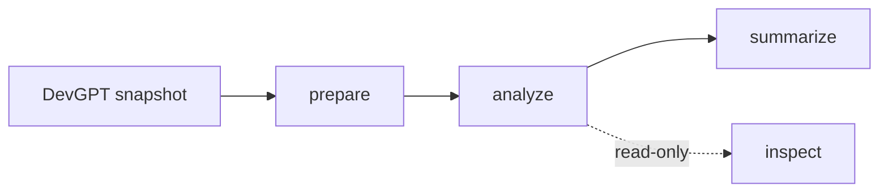
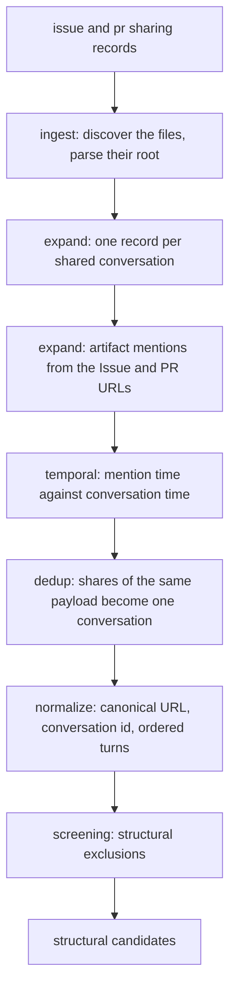
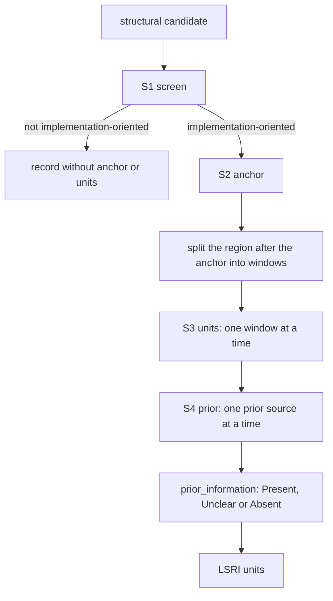

# Motivation Study

Analysis of **Later-Stated Requirement Information (LSRI)** in real developer–ChatGPT
conversations from the DevGPT Version 10 snapshot `snapshot_20240514`.

A conversation is *implementation-oriented* when the developer asks ChatGPT to build or change
something and ChatGPT answers with a concrete solution. Everything the developer states about that
task *after* the solution has been given is a later information increment. An increment is a **core
LSRI** when it is requirement-relevant and the conversation holds no earlier statement that already
carries the same information.

Every increment is labelled on four dimensions: `requirement_type` (which kind of requirement
knowledge it carries), `introduction_mode` (whether the developer raised it on their own initiative
or the assistant elicited it), `eeo` (whether the earlier part of the conversation had a reasonable
chance to ask for that information) and `response_uptake` (how the assistant answer reacted to it:
`Revised`, `Extended`, `No Uptake` or `Insufficient Evidence`).

## Research motivation and observed results

Some later solution revisions follow the introduction of requirement information that could reasonably have been elicited before the first concrete solution. The study examines this opportunity in real development conversations by connecting first expression, earlier elicitation opportunity (EEO), and subsequent response uptake.

The analyzed sample contains 553 conversations; 300 (54.25%) contain 2,400 LSRI. Of these LSRI, 1,393 (58.04%) have EEO=Yes, and 640 (26.67%) have both EEO=Yes and Revised uptake. These observations show that later requirement information is common in this sample and that earlier clarification offers an opportunity to reduce subsequent solution revision and rework.

## Division of labour

The LLM reads turns and answers with semantic labels, the short phrase each label was taken from,
and the turn it read that phrase from. Everything else is a program duty:

- identity — the conversation id, the canonical shared URL, the artifact ids;
- timing — whether an artifact already existed when the conversation happened;
- numbering — `U1..Un` in turn order;
- location — where a copied phrase sits in the conversation, verified against the turn the model
  named rather than against the whole conversation;
- derivation — `prior_information` from the prior verdicts, and the LSRI flag from
  `requirement_relevant` and `Absent`;
- counting — every number in the tables.

Reported counts are computed from the recorded classifications and source-linked evidence.

## Pipeline



`prepare`, `analyze` and `summarize` write artifacts and run in that order; `inspect` only reads what
they left behind.

Repository layout:

```text
motivation/
  cli.py            command line entry point
  config/           configuration models and the YAML files
  models/           record schemas for the dataset and for the analysis
  pipeline/         the stage implementations
  prompts/          system prompts of the four analysis steps
  llm/              chat completion client
  storage/          artifact writers and the manifest
  data/raw/         DevGPT snapshot (not tracked by git)
  data/derived/     prepared artifacts
  results/          analysis artifacts, tables and case shortlist
```

## prepare



A record is expanded into the turns it holds, and the Issue and PR URLs of the conversation become
its artifact mentions. Each mention is timed against the conversation: an artifact that already
existed when the conversation happened is `confirmed_prior`, anything else is `unclear`. Shares of
the same payload collapse into one conversation, and the shared URL is canonicalized before the
conversation id is derived from it.

The structural screen is deterministic and reads no model. It excludes a conversation when the share
page did not answer with status 200, when the conversation holds no turn, when it holds fewer than
two developer prompts, or when a turn has no content. The remaining conversations are the structural
candidates that the analysis runs over.

## analyze



**S1 screen** reads the whole conversation and decides whether the developer asks for an
implementation task, with a reason. A conversation the step rejects stops there.

**S2 anchor** reads the assistant turns and names the first turn that carries a concrete solution,
together with a phrase copied from it. The anchor is the turn: it is what the conversation continues
from. The phrase is only the evidence field, so a phrase that cannot be located leaves the anchor
turn in place with an empty evidence span, while a turn the input never rendered fails the
conversation after the retries.

**S3 units** splits the region after the anchor into consecutive windows of turns and reads one
window at a time. The assistant turns that precede a window are attached as reading context, and an
increment has to be stated in a developer turn inside the window, so what only appears in an
assistant answer never becomes an increment. Each increment is answered as a statement, the
`{turn_id, phrase}` it was read from, and its four labels.

**S4 prior** asks, once per prior source, which increments that source already carries. The prior
sources are the blocks of developer turns before the anchor and each artifact mention. The program
turns the answers into the `prior_information` of each unit: `Present` when a prior source carries
the increment, `Unclear` when only an unconfirmed artifact or a failed call speaks to it, and
`Absent` when the earlier part of the conversation says nothing about it. A confirmed prior artifact
that carries the increment is kept as artifact evidence on the unit.

The LSRI flag is derived, never answered:

```text
is_lsri = requirement_relevant and prior_information == "Absent"
```

Every copied phrase is located inside the turn the model named, on normalized text. A phrase that
does not occur exactly once there is rejected, and the rejection says whether the named turn is
unknown, the phrase absent from it, or the phrase repeated inside it. A rejected increment is
dropped from the record, a rejected anchor keeps its turn, and every rejection leaves a ledger
record naming the step and the scope that lost the part: the conversation, one window, one unit, or
one prior source.

The ledger is also what separates the two kinds of incompleteness. A conversation whose screen or
anchor step never settles has no analysis record and is counted as failed; a conversation that lost
part of its units or prior verdicts keeps its record and is counted as degraded. Ledger records
carry one of four codes: `LLM_TRANSPORT_ERROR`, `LLM_SCHEMA_ERROR`, `EVIDENCE_SPAN_MISMATCH` and
`MISSING_LSRI_FIELDS`.

## summarize

`summarize` reads the analyses and never calls the model. It writes the screening flow, one row per
analyzed conversation, the four distributions over LSRI with their counts and percentages, the
cross tabulations of those distributions, the visibility of prior artifact context, the
representative case shortlist, and one summary document holding all of these numbers.

Two denominators are used, at two levels. The conversation level is the analyzed conversations: the
implementation-oriented ones that have a solution anchor and at least one developer turn after it.
The unit level is the LSRI units of those conversations, and the four distributions and the cross
tabulations sum to it.

## inspect

`inspect` is read-only. Without `--conversation-id` it reports the prepared input set, the manifest
status and the derived counts. With `--conversation-id` it prints the artifact context that was
injected into the prompts, the turn index, the solution anchor with its evidence span, every
information increment with its labels and prior evidence, and the ledger records of that
conversation. Each evidence span is looked up again inside the turn it names and is reported as
located or not located, so the report audits the stored record instead of adding a second opinion
about it.

## Data and configuration

The study reads DevGPT Version 10 (DOI `10.5281/zenodo.16392320`), snapshot `snapshot_20240514`,
Issue and PR sharings. The extracted snapshot is placed at
`motivation/data/raw/DevGPT/snapshot_20240514/`; both source files are found by glob, so the download
timestamp prefix does not matter and the other sharing types in the same folder are ignored.

`motivation/config/default.example.yaml` is copied to `motivation/config/default.yaml` and filled in.
The dataset section names the snapshot and the source types. The analyzer section holds the endpoint,
the credential, the model, the temperature, the request timeout, the request attempts and the number
of conversations analyzed in parallel. Three further keys name the prompt directory and the two
output directories. Relative paths are resolved against the repository root. The configuration is
read at request time and recorded nowhere: the artifacts describe the study, not the machine that
produced it. `default.yaml` is gitignored and holds the only copy of the credential.

## Commands

```bash
python -m motivation.cli prepare   --config motivation/config/default.yaml
python -m motivation.cli analyze   --config motivation/config/default.yaml
python -m motivation.cli summarize --config motivation/config/default.yaml
python -m motivation.cli inspect   --config motivation/config/default.yaml
```

`analyze` takes `--conversation-id <id>` (repeatable) to restrict a run to named conversations,
`--limit <n>` to cap a run, and `--force` to re-analyze conversations that already succeeded.
`inspect` takes `--conversation-id <id>` to trace a single conversation.

`analyze` recalculates the conversations that were never analyzed and the conversations the ledger
lists, and leaves every other stored result untouched, pending conversations first; an interrupted
run therefore resumes with the conversations it never reached. `--force` recalculates all selected
conversations instead and compares nothing. A conversation is replaced whole, so the artifacts never
mix results of two different runs. `results/manifest.json` records where the last run stopped,
advancing from `prepared` to `analyzing`, `analyzed` and `summarized`; resuming reads the artifacts
rather than that status, so re-running a command is safe.

